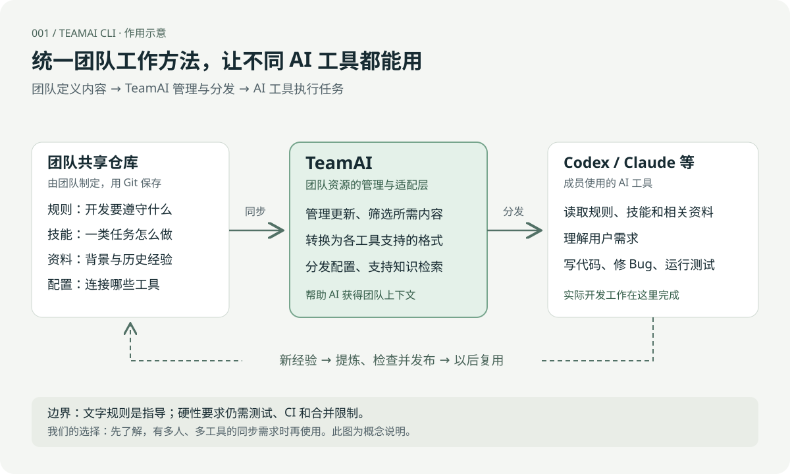
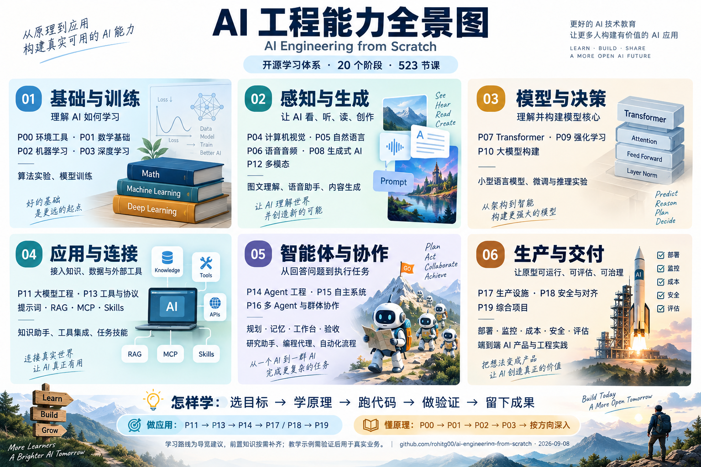

# GitHub 项目研究集

记录近期发现的优秀开源项目：为什么值得关注、如何运行、核心实现，以及可以借鉴的设计。

每个子项目独立保存研究笔记、截图和实验代码；本页提供有序索引和架构导读，帮助快速理解项目能力。

## 项目索引

<!-- PROJECTS:START -->
| 编号 | 项目 / 研究说明 | 摘要 | 状态 | 上游 | Web |
| --- | --- | --- | --- | --- | --- |
| 001 | [TeamAI CLI](projects/001-teamai-cli/README.md) | 为不同 AI 工具统一管理和分发团队规则、技能、资料与配置；先了解，按需使用。 | 已完成 | [GitHub](https://github.com/Tencent/teamai-cli) | — |
| 002 | [Mnemosyne](projects/002-mnemosyne/README.md) | AI 外部记忆的存储、检索与整理；暂不深入或接入，保留实现架构供开发类似能力时参考。 | 已完成 | [GitHub](https://github.com/mnemosyne-oss/mnemosyne) | — |
| 005 | [AI Engineering from Scratch](projects/005-ai-engineering-from-scratch/README.md) | 六大能力全景图、20阶段与523节课程导航，配套术语词典、学习路线和详细手册；导览已整理，课程未逐一验证。 | 已完成 | [GitHub](https://github.com/rohitg00/ai-engineering-from-scratch) | [演示](https://yydshly.github.io/0908_codex_project/demos/005-ai-engineering-from-scratch/) |
| 006 | [Signal Vaults](projects/006-signal-vaults/README.md) | 微信群、公众号等信息的 AI 日报工具；无当前接入需求，仅参考多源信息提取、筛选与个人日报的思路。 | 已完成 | [GitHub](https://github.com/JackyCufe/signal-vaults) | — |
<!-- PROJECTS:END -->

## 架构导读 · 001 TeamAI CLI

**Codex、Claude 等 AI 工具负责开发；TeamAI 负责把团队共同的规则、技能、资料和工具配置，适配并分发给这些工具。**



- **团队提供内容：**开发约定、工作步骤、项目背景、历史经验和工具配置。
- **TeamAI 管理与分发：**同步更新、按需筛选、适配不同工具，并支持知识检索。
- **AI 工具执行任务：**读取相关内容，再完成代码编写、问题修复和测试。
- **经验可以复用：**新经验经过提炼和发布，成为以后任务可用的资料。

规则由团队制定；文字指导不保证强制执行，硬性要求仍需测试、CI 和合并限制。上图为我们的概念归纳，不代表所有步骤都会自动发生。

**我们的结论：先了解，按需使用。** 当多人、多项目或多种 AI 工具需要共享同一套工作方法时，再考虑接入。

[查看能力介绍、使用场景与来源 →](projects/001-teamai-cli/README.md)

## 能力导览 · 005 AI Engineering from Scratch

**用一张全景图理解 AI 工程范围，再按目标查术语、选课程、做验证。** 当前完成知识导航与研究材料整理，暂不启动完整课程。



- **全景范围：**基础与训练、感知与生成、模型与决策、应用与连接、智能体与协作、生产与交付。
- **后期学习：**20 个阶段导读、523 节课程索引、技术名词释义、八条目标路线和实践记录模板。
- **研究边界：**课程与参考实现集合；目录已整理不代表课程已学完，教学模拟也不代表业务验证通过。

[打开学习地图 →](https://yydshly.github.io/0908_codex_project/demos/005-ai-engineering-from-scratch/) · [阅读完整手册 →](projects/005-ai-engineering-from-scratch/notes/learning-guide.md) · [研究说明 →](projects/005-ai-engineering-from-scratch/README.md)


## 阅读入口

- [研究目录](projects/)：按固定编号组织的子项目。
- [新增项目与维护约定](CONTRIBUTING.md)：编号、图片、索引和研究流程。
- [子项目说明模板](templates/project/README.md)：复制后填写。
- [Web 演示部署说明](docs/deployment.md)：统一站点、多个演示子路径。

## 目录结构

```text
projects.json                # 项目清单，README 与站点索引的数据来源
projects/001-project-name/   # 独立研究目录，编号永久保留
  README.md                 # 摘要、来源、结论、运行方法和图片说明
  assets/                   # 封面、截图、架构图
  notes/                    # 详细研究笔记
  experiments/              # 自己的验证与实验代码
web/001-project-name/        # 可选：静态演示发布文件
templates/project/          # 子项目模板，不计入正式索引
scripts/build.py            # 校验清单、更新 README、生成展示站点
docs/                       # 维护与部署说明
```

## 本地预览

需要 Python 3.10 或更新版本，无需安装第三方依赖。

```sh
python scripts/build.py
python -m http.server 8000 --directory _site
```

打开 <http://localhost:8000>。站点构建目录 `_site/` 不提交到 Git。

## 来源与许可

研究记录需注明上游仓库、所研究的版本或 commit、原项目许可证。引用代码与图片时保留来源并遵循原许可；本仓库初始化阶段未为原创内容指定统一开源许可证。
