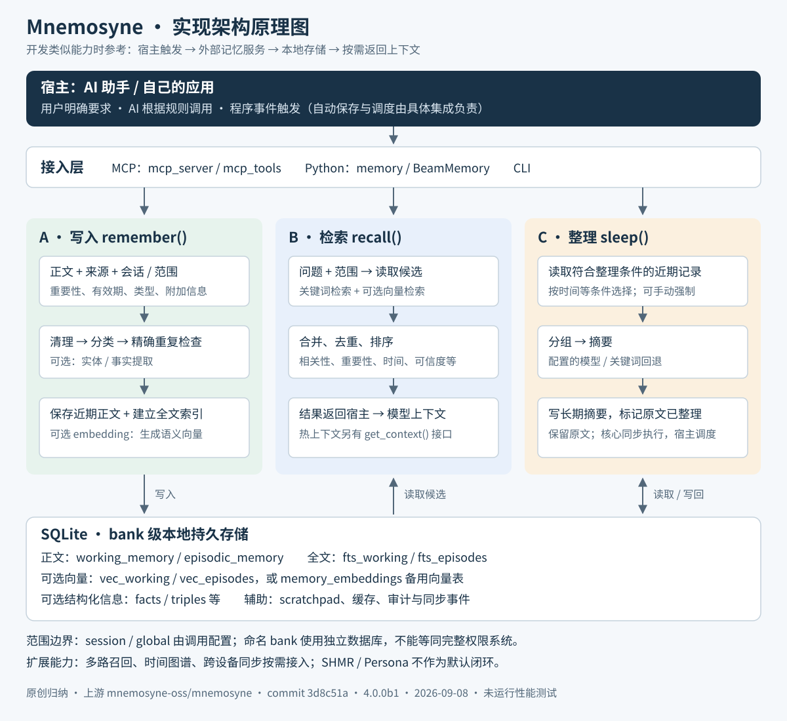

# 002 · Mnemosyne

> AI 的外部记忆系统：由工具或程序写入值得沉淀的信息，再按任务需要检索、整理和更新。
>
> **我们的结论：当前不继续深入研究或接入。保留实现架构，等开发类似的记忆、经验沉淀或知识检索能力时再参考。**

阅读入口：[首页整体引导](../../README.md#架构导读--002-mnemosyne) → [本文详细实现架构图](#实现架构原理图) → [源码导航](#源码导航与研究边界)。

## 我们最终形成的理解

**它的本质是面向 AI 的外部信息存储、整理与检索系统。** 把使用 AI 时希望沉淀的内容存下来，按来源、类型、时间和范围组织，再根据后续任务找回相关记录。提取与摘要可以借助模型，持久存储与检索依靠数据库、索引和排序逻辑。

它本身不是 Skill。Skill 可以规定“什么时候保存、保存什么、什么时候查询”；Mnemosyne 提供执行这些操作的工具和存储机制。它能作为经验库或知识库的底层参考，完整知识库的内容审核、权限、分类展示和发布仍需另外设计。

### MCP 方式下，谁决定写入、谁真正执行？

`用户要求或工作规则 → 大模型提出工具调用 → AI 客户端执行 MCP 请求 → Mnemosyne 服务处理并写入 SQLite → 返回结果`

这是客户端调用服务端的交互方式，服务可以在本机运行，不要求远程服务器。MCP 是一种接入方式；自己开发程序时可以直接调用 Python SDK，在同一进程内使用核心库。

| 决策或执行者 | 职责 | 例子 |
| --- | --- | --- |
| 用户 | 明确要求保存或查询 | “记住这个项目的采用条件” |
| 大模型 | 根据请求和规则选择工具、组织待写入内容 | 提炼已确认的决策，提出保存调用 |
| 宿主程序 | 执行工具调用；也可按固定事件直接触发 | 收到消息后按配置保存，不必先让模型判断 |
| Mnemosyne | 校验和处理内容、写入数据库、整理与检索 | 去重、建立索引、返回相关记忆 |

**写不写、写什么由用户、模型或程序策略决定；怎样存、怎样整理和找回由记忆系统实现。** 模型不会直接操作数据库，安装 MCP 也不会自动记录所有历史对话。实际保存的内容可能是原始消息，也可能是宿主或模型提炼的结论。

### 对我们的价值与后续边界

当前保留“存 → 理 → 取”的架构和源码入口即可，不继续投入深入研究。以后需要开发跨任务记忆、项目经验沉淀或知识检索功能时，再参考它的实现。届时先制定内容选择、证据保留、纠错与失效规则，再决定是否采用该库或自行实现。

## 实现架构原理图

图为依据指定版本源码绘制的实现归纳，不是上游官方图片。列出了主要链路，未穷举兼容表、缓存、媒体附件和所有插件；可选模块并非安装后全部启用。

[打开可缩放详图](assets/architecture.svg) · [打开 PNG 详图](assets/architecture.png)

## 读图要点

1. **触发属于宿主。** 用户要求、AI 按规则选择工具、程序事件都可以调用接口。Skill 可以指导调用时机；MCP 负责暴露工具。核心库不会自行监视所有对话。
2. **记忆属于外部存储。** 正文、属性、摘要、向量与事实存入本地数据库，不更新模型参数。核心 `remember()` 的默认范围为 `session`；跨会话读取需要正确配置 scope 与 session。不同 bank 使用独立数据库。
3. **全文与向量是两种检索信号。** FTS5 查关键词，embedding 查语义；正文仍需保留。无向量能力时可以退回词法检索。
4. **回忆与热上下文是不同接口。** `recall()` 按问题检索；`get_context()` 获取近期上下文。由宿主选择如何将结果加入提示词，MCP 返回结果本身不等于自动注入每一轮。
5. **整理需要被调用。** `sleep()` 在核心库中同步执行；自动调度由集成方承担。当前版本的整理会生成摘要并标记原记录，保留原文；已整理内容默认不再占用热上下文，但可供检索。

## 三条关键调用链

### 写入

`宿主选择内容 → remember() → 内容清理、类型分类、精确重复检查 → working_memory → 全文索引与可用的向量表示`

内容可包括用户偏好、事实、决定、目标、事件、项目背景、经验、错误和资料引用。规则分类不会证明内容真实。`extract=True` / `extract_entities=True` 是可选提取开关，核心接口默认关闭。调用方应提供真实来源、适用项目、版本与有效时间；来源链接和 commit 不会凭空自动补全。

### 检索

`当前问题与范围 → recall() → 近期／长期候选召回 → 合并去重与评分 → 相关结果 → 宿主组织上下文 → 模型回答`

默认长期记忆评分以语义 0.5、关键词 0.3、重要性 0.2 为基础，并叠加时间、层级、可信度等因素；这些权重可调整，不能视为所有检索路径统一公式。可选增强路径包括多路召回融合和多样性排序。

向量回退路径：`sqlite-vec → JSON 向量配合 NumPy 余弦计算 → 词法检索`，实际可用路径取决于依赖和 embedding provider。当前代码还有针对 CJK 等语言的检索辅助逻辑；中文效果仍需实际评测。

### 整理

`宿主／用户调用 sleep() → 选择符合条件的记录 → 分组与摘要 → 写入 episodic_memory → 标记来源记录已整理`

摘要可以使用配置的宿主模型、远程模型、本地模型，或关键词回退。核心 `sleep()` 不是定时后台服务；Hermes provider 有自动整理与会话结束处理逻辑，通用 MCP 接入不自动继承这些行为。

## 数据结构参考

| 结构 | 主要职责 | 实现类似能力时关注什么 |
| --- | --- | --- |
| `working_memory` | 正文、来源、会话、范围、重要性、时间、类型、整理标记等 | 写入幂等性、跨项目范围、失效与删除 |
| `episodic_memory` | 长期摘要及关联信息 | 摘要能够回查原始证据，失败可恢复 |
| `fts_working` / `fts_episodes` | SQLite 全文索引 | 正文变化后索引一致性、中文检索 |
| `vec_working` / `vec_episodes` | 可选 sqlite-vec 向量索引 | 模型与维度一致、模型更换后重建 |
| `memory_embeddings` | 备用向量表示 | 没有向量扩展时的检索回退 |
| `facts` / `triples` 等 | 结构化事实、关系、有效时间 | 旧值与新值、来源可信度、历史查询 |
| `scratchpad` | 临时工作区 | 不参与长期记忆检索与整理 |
| 同步事件与审计表 | 可选同步、整理与维护记录 | 冲突、删除传播、可追溯性 |

默认主库为用户目录下 `.hermes/mnemosyne/data/mnemosyne.db`；命名 bank 位于 `banks/<name>/mnemosyne.db`，数据根目录可配置。独立 `TripleStore()` 可使用另一个 `triples.db`。因此“一个 SQLite 文件”描述的是主要部署形态，不保证所有功能永远只产生一个文件。

## 将来自己实现时的起点

以下是我们的建议，不是上游实现承诺：先做 **写入／查询／失效接口 + SQLite 正文与来源 + FTS5 + 宿主调用时机**。用真实问题验证是否减少重复解释，再增加语义向量与摘要整理；时间图谱、跨设备同步和多路召回按需求增加。

应优先明确的接口约定：

- 写入：`content, source, project/session, scope, valid_until, evidence`。
- 检索：`query, project/session, scope, top_k`，返回正文、来源、时间和排序依据。
- 更新：明确旧记录是被修正、过期还是撤销，避免只追加新说法。
- 整理：保留来源关系，处理摘要失败与重复执行。
- 隔离：项目或用户范围要在检索前约束；不要把 bank 本身当成完整权限系统。

暂不将 SHMR、Persona 等高级能力纳入最小实现。该版本文档明确注明 SHMR 尚未接入交付调用链，Persona 仅部分接线。

## 源码导航与研究边界

| 模块 | 阅读入口 |
| --- | --- |
| MCP 接口 | [mcp_server.py](https://github.com/mnemosyne-oss/mnemosyne/blob/3d8c51a865bc304d541bcfe561771ee676a92fcc/mnemosyne/mcp_server.py)、[mcp_tools.py](https://github.com/mnemosyne-oss/mnemosyne/blob/3d8c51a865bc304d541bcfe561771ee676a92fcc/mnemosyne/mcp_tools.py) |
| Python 外观接口 | [core/memory.py](https://github.com/mnemosyne-oss/mnemosyne/blob/3d8c51a865bc304d541bcfe561771ee676a92fcc/mnemosyne/core/memory.py) |
| 存储、索引、写入、检索与整理核心 | [core/beam.py](https://github.com/mnemosyne-oss/mnemosyne/blob/3d8c51a865bc304d541bcfe561771ee676a92fcc/mnemosyne/core/beam.py)：`remember`、`get_context`、`recall`、`sleep` |
| 向量与压缩 | [core/embeddings.py](https://github.com/mnemosyne-oss/mnemosyne/blob/3d8c51a865bc304d541bcfe561771ee676a92fcc/mnemosyne/core/embeddings.py)、[core/binary_vectors.py](https://github.com/mnemosyne-oss/mnemosyne/blob/3d8c51a865bc304d541bcfe561771ee676a92fcc/mnemosyne/core/binary_vectors.py) |
| 时间关系与分库 | [core/triples.py](https://github.com/mnemosyne-oss/mnemosyne/blob/3d8c51a865bc304d541bcfe561771ee676a92fcc/mnemosyne/core/triples.py)、[core/banks.py](https://github.com/mnemosyne-oss/mnemosyne/blob/3d8c51a865bc304d541bcfe561771ee676a92fcc/mnemosyne/core/banks.py) |
| 自动触发的集成实例 | [hermes_memory_provider](https://github.com/mnemosyne-oss/mnemosyne/blob/3d8c51a865bc304d541bcfe561771ee676a92fcc/hermes_memory_provider/__init__.py)：`sync_turn`、`_maybe_auto_sleep`、`on_session_end` |

上游：[mnemosyne-oss/mnemosyne](https://github.com/mnemosyne-oss/mnemosyne)。研究日期：2026-09-08。研究提交：`3d8c51a865bc304d541bcfe561771ee676a92fcc`；代码版本：`4.0.0b1`；上游许可：[MIT](https://github.com/mnemosyne-oss/mnemosyne/blob/3d8c51a865bc304d541bcfe561771ee676a92fcc/LICENSE)。

状态：已完成基础了解与实现架构留档，未安装、未运行上游功能或性能测试。图与说明为本仓库原创归纳，未复制上游实现代码。

补充来源：[架构文档](https://github.com/mnemosyne-oss/mnemosyne/blob/3d8c51a865bc304d541bcfe561771ee676a92fcc/docs/architecture.md)、[SHMR 状态](https://github.com/mnemosyne-oss/mnemosyne/blob/3d8c51a865bc304d541bcfe561771ee676a92fcc/docs/shmr.md)、[Persona 状态](https://github.com/mnemosyne-oss/mnemosyne/blob/3d8c51a865bc304d541bcfe561771ee676a92fcc/docs/persona.md)。
