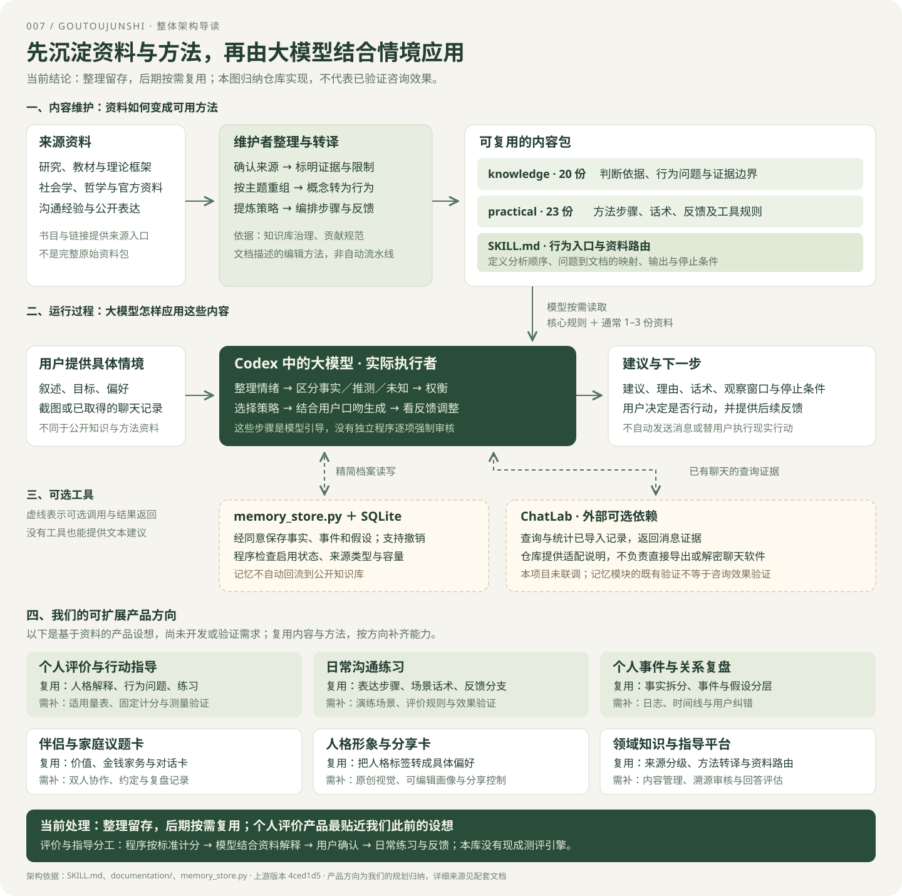

# 007 · 狗头军师 · 资料留存与架构导读

> 资料整理完成，保留架构、43份参考文档索引与固定版本源码，供后期按需复用；不继续深入研究或接入。

## 基本信息

| 项目 | 内容 |
| --- | --- |
| 上游 | https://github.com/shengjidaguai-china/goutoujunshi |
| 研究版本 | `4ced1d57561563f4b556f555ee1c8c91ffb16355` |
| 上游许可 | MIT，Copyright (c) 2026 powerycy |
| 日期 | 2026-09-08 |
| 状态 | 整理已完成；后期按需复用，不继续深入研究 |
| 技术 | Markdown Skill、Python 标准库、SQLite、可选 ChatLab |
| 本地源码 | `upstream/`，独立 Git 克隆，按总仓库约定忽略提交 |
| 演示源码 | [资料与方法地图](../../web/007-goutoujunshi/index.html) |

## 整体架构导读



- **资料层：**来源经过分级、主题整理和方法转译，形成20份知识文档、23份实用资料及核心路由。
- **执行层：**Codex中的大模型结合用户情境读取资料，生成建议与反馈条件；核心咨询步骤属于文字引导。
- **工具层：**经同意的有限记忆与可选ChatLab补充档案或证据，用户信息不自动回流到公开知识库。

[阅读架构说明与复用入口](notes/architecture.md)。图中内容整理表示维护规则，不是自动采集清洗流水线；本库也不是完整人格测评系统。

## 模块详解与后期产品方向

[阅读完整说明](notes/modules-and-products.md)：按 10 个模块说明知识方向、使用机制、参考价值和缺口。核心知识展开为 7 个方向，实用资料展开为 5 个方向，附全部资料入口。

整理了 6 类产品设想：个人评价与行动指导、沟通练习、事件与关系复盘、家庭议题卡、人格形象分享、领域知识指导平台。每类均列用户体验、可复用资料、缺口、首版范围与价值判断方法。个人评价另拆为 5 类信息，并明确固定规则计分与模型指导的分工。产品部分是规划判断，尚未开发或验证需求。

对外统一使用[整体架构与产品方向图](assets/architecture.svg)。Web 首页以图为主，分别进入 `reuse.html` 的模块与产品说明，以及 `materials.html` 的资料目录。

## 资料与方法汇总

**主要入口：[完整整理说明与43份资料目录](notes/materials-overview.md)。**

- 实际目录：20 份核心知识、23 份实用资料；文件数不是独立文献或训练样本数。
- 来源：研究与教材、人格和沟通框架、哲学与社会学、官方资料、社交经验和工具设计参考。
- 整理逻辑：确认来源与限制 → 按问题重组 → 概念行为化 → 经验方法化 → 建立路由 → 持续维护。
- 分级区别：内容性质、研究证据强弱、策略使用分级各司其职；实用 A 不等于研究 A。
- 原文追踪：关系理论到四区判断、表达经验到七种策略、冷读到可纠正假设。
- 运行边界：模型按需读取和应用资料；没有完整自动采集清洗流水线，用户档案不自动回流到公开知识库。

## Web 展示

从总仓库启动站点后，打开 `/demos/007-goutoujunshi/`。

首页展示简洁架构图，图中概括六个产品方向、可复用资料与能力缺口。详细页面支持搜索全部 43 份文档、按核心知识／实用资料筛选、展开原文章节及打开固定版本原文。[结构化目录](notes/materials-catalog.json)与文档、Web 使用同一份清单。

原来的三个固定案例和 12 项记忆验证移到 Web 附录 `examples.html`。案例为教学改写，未调用模型，不能证明咨询效果；首个案例现按上游“本轮降压、不连环追加”的规则纠正。

## 获取与运行

本次已将上游克隆至本子项目的 `upstream/`，未安装到全局 Skill 目录。新环境可以从总仓库根目录运行：

```sh
git clone https://github.com/shengjidaguai-china/goutoujunshi.git projects/007-goutoujunshi/upstream
git -C projects/007-goutoujunshi/upstream checkout 4ced1d57561563f4b556f555ee1c8c91ffb16355
python projects/007-goutoujunshi/upstream/scripts/validate_skill.py
python projects/007-goutoujunshi/experiments/verify_memory.py
python projects/007-goutoujunshi/experiments/build_materials.py
python scripts/build.py
python -m http.server 8000 --directory _site
```

使用该 Skill 进行模型咨询还需要支持 Skill 的宿主环境及相应模型。本次不安装 ChatLab，不启用个人长期记忆。

## 原理与边界

1. `SKILL.md` 指导模型完成情绪承接、事实拆分、利益判断、建议和行动收束。
2. `references/` 按主题提供知识和话术，默认读取 1–3 份文件；没有向量检索实现。
3. `memory_store.py` 将精简字段写入 SQLite，按对象召回，限制来源和容量，支持暂停、撤销、删除。
4. ChatLab 适配是使用说明，查询需要额外安装的外部工具；不能直接解密或导出聊天软件数据库。

记忆来源由调用方声明，脚本不能证明声明真实。模型推断只能进入假设字段；主记忆表最多 200 条，单值最多 200 字符。模型负责判断何时调用脚本，没有后台自动观察程序。本地存储不等于模型处理完全本地化，SQLite 本身也不提供本项目级加密。

## 实验与发现

- 上游结构校验通过；主要检查文件、链接、预算与规则文字，不评测模型回答。
- [记忆验证结果](notes/memory-verification.json)：12 项通过，覆盖确认启用、事实保存、对象召回、拒绝推断升级、暂停、恢复、撤销与清空。
- [可复现实验](experiments/verify_memory.py)：实际调用上游命令，使用临时目录与虚构输入，不接触个人记忆目录。
- 未验证：真实模型咨询质量、截图识别质量、ChatLab 联调、长期使用收益。

## 对我们的意义

最值得迁移的是把可靠资料整理成领域方法，再由模型按需应用的内容组织方式；其中包含“事实 / 推测 / 未知 → 具体行动 → 观察窗口 → 反馈复盘”的顾问结构。用于项目研究时，可记录源码证据、实验结论、暂缓接入理由和重访条件。当前仅作资料参考，不再增加实验或开展产品开发。需要复用时，再按具体场景核对来源、适用性、时效和许可。

## 来源与许可

- [核心规则](https://github.com/shengjidaguai-china/goutoujunshi/blob/4ced1d57561563f4b556f555ee1c8c91ffb16355/SKILL.md)
- [架构](https://github.com/shengjidaguai-china/goutoujunshi/blob/4ced1d57561563f4b556f555ee1c8c91ffb16355/documentation/architecture.md)
- [记忆源码](https://github.com/shengjidaguai-china/goutoujunshi/blob/4ced1d57561563f4b556f555ee1c8c91ffb16355/scripts/memory_store.py)
- [MIT 许可](https://github.com/shengjidaguai-china/goutoujunshi/blob/4ced1d57561563f4b556f555ee1c8c91ffb16355/LICENSE)

上游克隆保留完整许可；本页案例、研究说明和展示页面为本项目编写。Web 静态文件与文档随项目留存；GitHub Pages 由总仓库部署流程发布。

## 交付范围

整体架构与产品方向图作为总仓库、子项目文档和 Web 首页的统一入口。保留 43 份资料索引、10 个模块说明、6 个产品方向与个人评价专项；既有实验记录留作附录，不代表后续研究计划。
