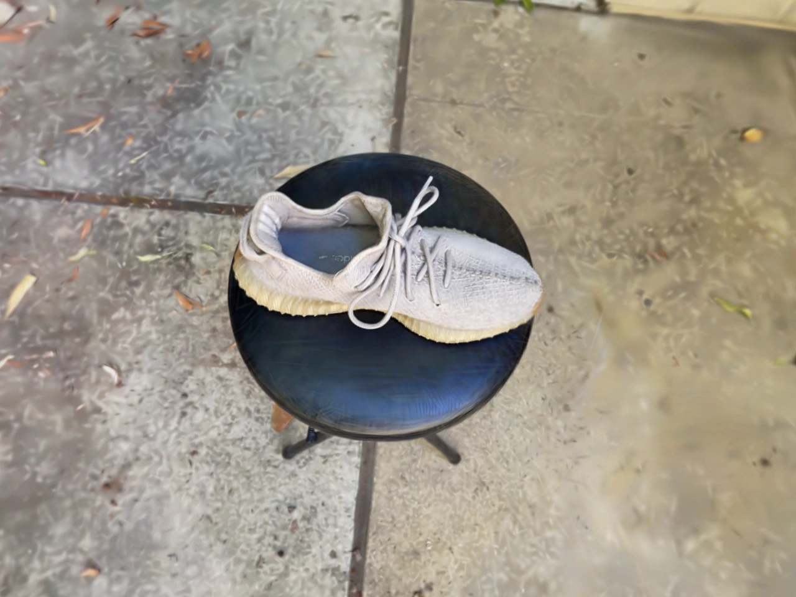

# 008 · Splat.js 视频到三维实测与扩展指南

**结论：可以把静态对象的多角度照片或绕拍视频，在本机浏览器里重建成可拖动、缩放的三维外观。我们已用独立作者的鞋子原视频跑通完整流程。**

上图由本次保存的 `model.sog` 实时渲染后导出，是最终三维效果截图；不是输入照片或示意图。README 展示静态预览，点击图片进入可交互网页。

[打开完整网页](https://yydshly.github.io/0908_codex_project/demos/008-splat-js/) · [原视频与三维结果对照](https://yydshly.github.io/0908_codex_project/demos/008-splat-js/video-test.html#result) · [完整能力文档](notes/capability-guide.md)

## 实测总结

| 实验 | 输入 | 实际结果 |
| --- | --- | --- |
| 独立鞋子视频 | N. Escobar / nickesc 的 65.5 秒原视频；非上游样例 | 自动选出 223 帧，223/223 视角定位，10,015 次训练，3.8 MB SOG；已验证重载、拖动和缩放 |
| Truck 本机复训 | 100 张上游照片 | 100/100 定位，10,035 次训练，19.6 MB 高斯 PLY |
| Truck / Bar 官方成品 | 作者已训练的模型 | 已验证成品查看；Bar 没有在本机重新训练 |

视频训练时有 350,000 个高斯，SOG 实际保留 311,757 个。Draft 480 px，训练分数 28.68 dB，无留出测试集。RTX 4070 Laptop GPU 上输入到完成约 27 分钟，含人工启动和观察间隔；纯外观训练约 1 分钟。单次实测不是通用速度承诺。

## 能力与原理

多角度照片／视频 → 浏览器解码选帧 → SIFT 特征与 GPU 匹配 → SfM 相机及空间求解 → WebGPU 三维高斯训练 → PLY／SOG 保存与交互查看。

[下载矢量架构图](../../web/008-splat-js/assets/architecture-guide.svg)

作者实现的是已有视觉与 3DGS 方法的浏览器流程，核心计算不依赖后台建模平台。当前成品 SOG 由原应用内置的 PlayCanvas / WebGL2 查看；训练使用 WebGPU。

## 对我们的意义与扩展方向

- **商品展示：**在真实三维结果上增加细节热点、快捷视角、商品资料和链接，可先复用已验证的鞋子。
- **空间导览：**门店、展厅、房源浏览；先补普通房间视频实测，再增加路线讲解、房间切换和移动限制。
- **视觉留档与内容制作：**工艺品记录、布展前后对照、镜头路线和视频输出，需要版本及内容工具。
- **固定穿搭：**可研究同一姿势的立体展示；人体尚未实测，动作与换装需要额外技术。

当前最明确的价值是“采集真实外观 → 保存三维资产 → 网页交互展示”。结果不自动提供连通网格、准确尺寸、碰撞、骨骼或自动换装。白墙、反光、运动与未覆盖区域可能影响重建质量。

## 复现与查看

1. 在仓库根目录运行 `python projects/008-splat-js/experiments/video-sample/fetch_source.py` 恢复本地原视频（SHA256 校验）。
2. 运行 `python scripts/build.py`，再运行 `python -m http.server 8018 --directory _site`。
3. 打开 `http://localhost:8018/demos/008-splat-js/`。查看已保存模型无需重新训练。

公共网页从作者原地址加载 MP4；原视频不重复提交到本仓库。网页保留照片训练、合成测试、自有素材入口及原理示意。训练需要合适的 WebGPU 设备。

## 记录与来源

- [完整能力、输入输出、房间与人体边界、扩展场景](notes/capability-guide.md)
- [独立视频实测记录](notes/independent-video-validation.md) · [Truck 与官方模型验证](notes/real-demo-validation.md)
- [本机导出的 Truck 高斯 PLY](experiments/results/truck-draft-100photos.ply)
- [封面来源与复现说明](assets/SOURCE.md)
- [上游固定快照](https://github.com/arrival-space/splat.js/tree/128438ac803aacf868938471dcd52f2a16e0d3a6) · [运行器来源与改动](../../web/008-splat-js/engine/NOTICE.md)
- [独立视频作者](https://nickesc.github.io/PhotogrammetryVideoInstructions/) · [Bar 原数据项目 360Roam](https://huajianup.github.io/research/360Roam/)

2026-09-09 已完成本轮能力整理与真实实验。上游代码 MIT；数据与媒体许可独立，Bar 数据为 CC BY-NC-SA。原视频、衍生预览与模型保留来源，不因代码许可而自动获得媒体商用授权。
