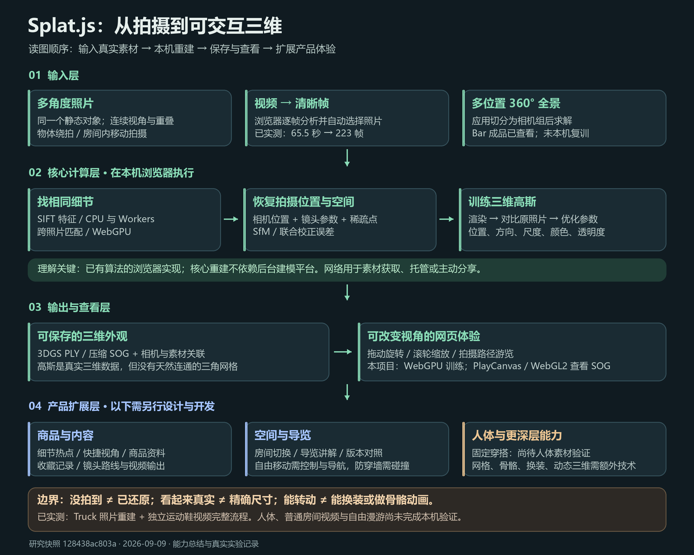

# Splat.js 能力、场景与扩展指南

总结版 · 2026-09-09。整理范围固定为 `128438ac803aacf868938471dcd52f2a16e0d3a6` 对应的本地研究快照。本轮文档和网页已获用户确认，整理为可提交的研究成果。

## 1. 一句话理解

**把围绕静止物体或空间拍摄的照片／视频，在浏览器里重建成可改变观察角度的三维外观。**

例如：拍一段绕鞋视频 → 自动抽帧 → 求出拍摄位置 → 训练三维高斯 → 网页中拖动、缩放查看。结果确实包含三维空间中的数据，不是视频进度条或一组图片切换；表示形式是 Gaussian Splatting，不是传统三角网格。

## 2. 输入是什么

| 输入 | 要求 | 验证范围 |
| --- | --- | --- |
| 多角度照片 | 同一静态对象；连续视角、清晰、有重叠、有纹理 | 已实测 100 张 Truck 照片 |
| 普通视频 | 相机移动，目标尽量不动；优先连续绕拍或空间行走拍摄 | 已实测独立作者的 65.5 秒运动鞋视频 |
| 多位置的 360° 全景照片 | 不同位置采集；应用可切成立方体面，按相机组求解 | 上游 Bar 样例；本项目验证了成品查看，未复训 |

普通照片／视频流程不要求用户手填每张图的相机位置。视频先解码并选帧，再走照片重建流程；音轨不参与三维重建。视频中的人走动、物体变形、剪辑切镜并不会自动变成可播放的动态三维。

拍摄不能只追求“角度不同”：需要相邻画面能找到共同细节，并有相机位置变化。纯原地转动通常不足以可靠恢复深度。镜子、玻璃、大面积白墙、运动模糊、光照变化、遮挡会降低成功率；没拍到的地方不能保证还原。

## 3. 底层如何工作

| 步骤 | 作用 | 主要执行位置 |
| --- | --- | --- |
| 视频解码与选帧 | 逐帧分析清晰度、曝光和画面运动，选取训练照片 | 浏览器 WebCodecs／Mediabunny；有回退路径 |
| SIFT 特征提取 | 找到重复可辨认的局部细节 | CPU 与 Web Workers |
| 特征匹配与相机求解 | 建立跨图对应，估计相机位置、镜头参数和稀疏点；联合校正误差 | GPU 匹配 + JavaScript 几何求解与 Bundle Adjustment |
| 高斯初始化与训练 | 为三维点设置位置、方向、尺度、颜色与透明度；比较渲染图与原照片，反复优化并增减／迁移高斯 | WebGPU |
| 保存与查看 | 导出高斯 PLY、压缩为 SOG，保存相机路径和照片关联；重新渲染新视角 | 库与应用层；本项目 SOG 查看使用 PlayCanvas / WebGL2 |

这是作者对已有计算机视觉和 3DGS 方法的实现。既不是全部算法由作者原创，也不是把素材交给后台平台完成核心建模。外部素材下载、模型托管、主动分享是另外的网络环节。训练优化的是当前场景的参数，不是训练一个能理解任意物体的通用大模型。[固定版本源码](https://github.com/arrival-space/splat.js/tree/128438ac803aacf868938471dcd52f2a16e0d3a6)、[3DGS 原论文](https://repo-sam.inria.fr/fungraph/3d-gaussian-splatting/)

## 4. 输出与传统模型的区别

| 维度 | 当前高斯结果 | 传统网格资产 |
| --- | --- | --- |
| 表示 | 带颜色和透明度的三维椭球 | 顶点、三角形、材质／贴图 |
| 擅长 | 复现拍摄对象和场景的视觉外观 | 表面编辑、形变、物理结构等工作流 |
| 查看 | 旋转、缩放、相机路径游览；可增加其他控制方式 | 使用相应模型查看器与控制器 |
| 可编辑表面 | 没有天然连通的三角表面 | 有网格表面，但仍要检查质量 |
| 人体动作 | 不自动带骨骼、蒙皮或服装分层 | 也需要合适拓扑、骨骼与蒙皮后才能做动作 |
| 尺寸／打印 | 不自动保证真实尺度、封闭实体或精度 | 也需尺度校准、闭合与制造检查 |

库可导出 3DGS PLY；应用可以压缩为 SOG，并保存包含相机等信息的会话。**PLY 只是容器名称，不能仅凭扩展名判断它是网格。**本次独立视频交付为 SOG + recon.json + 实际抽帧预览。

若目标是可编辑网格，需要额外的表面重建、清理／补洞、拓扑和纹理处理。SuGaR 是可研究的表面约束及网格提取路线；其与本项目输出的直接衔接没有验证，不是改后缀即可转换。保留原视频、照片和相机参数。[SuGaR 项目](https://anttwo.github.io/sugar/)

## 5. 样例与证据

| 样例 | 输入来源 | 谁生成结果 | 本项目验证 |
| --- | --- | --- | --- |
| Truck 官方成品 | Tanks & Temples 的 251 张照片 | Splat.js 作者；约 105 万训练高斯 | 成品加载、路径游览 |
| Bar 官方成品 | 360Roam 的 102 张手持全景照片 | Splat.js 作者；约 400 万训练高斯 | 成品加载与视角交互；没有本机复训 |
| Truck 本机复训 | 上游提供的 100 张实拍照片 | 本项目本机运行 | 100/100 定位；10,035 次；35 万训练高斯；导出 PLY 19.6 MB |
| 独立运动鞋视频 | N. Escobar / nickesc 公开拍摄视频 | 本项目从原 MP4 重新训练 | 223/223 定位；10,015 次；35 万训练高斯；SOG 3.8 MB；重载、拖动、缩放 |
| 合成测试 | 上游 12 张渲染图片 | 上游输入；可本机运行 | 已验证入口，没有宣称本次完成整轮训练 |

运动鞋视频为 2160 × 3840、60 fps、65.516667 秒。原库分析 3,931 帧后保留 223 帧，Draft 480 px / SH0。训练照片 PSNR 28.6756 dB，没有留出测试集；不能与作者的测试集分数比较。SOG 实际保存 311,757 个高斯，低于训练时的 350,000，因为导出过滤了几乎不可见的高斯。

本机为 RTX 4070 Laptop GPU。运动鞋视频输入到训练完成约 27 分钟，含人工启动与观察间隔，主要耗时在相机求解；纯外观训练约 1 分钟。这是一次运行记录，不是通用速度承诺。鞋子、鞋带、鞋口和凳子可辨识，背景与细纹理仍有模糊；鞋底被凳面遮挡。

“我们的原视频”在本指南中指**我们选用的独立公开输入**，不是我们拍摄或拥有版权的素材。没有使用该作者已有的点云或渲染结果。上游固定快照未附带 Truck／Bar 原始 MP4；网页明确呈现原照片和成品模型，另提供 360Roam 原数据项目的视频资料，它不是 Splat.js 的训练录像。

- [照片与官方模型验证记录](real-demo-validation.md)
- [独立视频完整记录](independent-video-validation.md)
- [独立视频来源](https://nickesc.github.io/PhotogrammetryVideoInstructions/)
- [360Roam 原数据项目与视频](https://huajianup.github.io/research/360Roam/)

## 6. 房间如何拍、如何看

拍客厅时，相机沿不同位置缓慢移动，覆盖墙角、家具、门口和必要的连接区域，保持画面重叠。对象、灯光尽量稳定。单个位置环顾四周的全景体验，与在三维空间里移动、产生前后遮挡变化，是两种体验。

| 展示方式 | 用户体验 | 需要的能力 |
| --- | --- | --- |
| 环顾 | 从某一位置向四周看 | 视角控制；全景本身也能实现，不能据此判断三维重建成功 |
| 路径导览 | 从门口经过沙发，看到窗边 | 相机路径；本项目原应用已支持拍摄路径游览 |
| 自由漫游 | 改变位置与方向，自主探索 | 适合室内的移动控制；导航范围、碰撞与防穿墙需要额外开发 |
| 多房间 | 点击门口切换房间，或连续行走 | 场景连接与导航管理；连续几何重建还要求门口／走廊有足够覆盖并成功对齐 |

本项目没有完成“普通房间视频 → 自由行走”的实测。Bar 是上游成品查看证据，不能当作我们已验证任意房间视频的证据。未覆盖区域可能空洞或拉伸，镜子和白墙尤其需要检查。

## 7. 人体与穿搭

可研究固定姿势的立体穿搭展示：人尽量不动、相机绕行，或多相机同步拍摄。呼吸、晃动、发丝和衣服摆动仍可能影响结果。本项目尚未人体实测。

不能直接由此获得自动换衣、走路动画或准确体型测量。换装需要人体／服装分层、可形变模型、骨骼蒙皮等额外能力；衣服挡住的身体形状并未被相机直接记录。它更适合先验证“某个人穿某套衣服的可转动展示”。

## 8. 可扩展场景

| 场景 | 交付体验 | 需要增加 | 成功判断 |
| --- | --- | --- | --- |
| 商品详情页 | 转动鞋包、家具，查看细节 | 热点标注、快捷视角、商品资料与购买链接 | 用户能否找到需要的侧面／细节；加载和交互是否流畅 |
| 门店／展厅 | 空间导览与展品讲解 | 讲解内容、展品关联、路线编辑 | 用户能否顺利找到展品并理解信息 |
| 民宿／房源 | 房间浏览与设施说明 | 室内控制、房间切换、范围限制 | 是否覆盖关键区域，有无穿墙或严重空洞 |
| 收藏／文化记录 | 多角度观察雕塑和工艺品 | 局部标注、出处故事、版本管理 | 关键外观是否能辨认，档案来源是否完整 |
| 固定穿搭作品 | 看同一套衣服的前后侧面 | 人体采集规范、单品链接、视角收藏 | 固定姿态质量；不以换装或动作作为现成能力 |
| 状态留档 | 比较装修、布展前后 | 时间版本、同视角对照、人工问题标注 | 对照位置是否一致；不自动声称精确测量／验收 |
| 内容制作 | 为展示视频选择镜头 | 路线编辑、字幕、录制／编码输出 | 是否能稳定导出有用的镜头片段 |
| 场景问答 | 点物体查看说明或提出问题 | 人工标签／可信资料库、检索和额外 AI 接口 | 回答是否有资料依据；库本身不理解商品语义 |

## 9. 扩展工作的层次与优先顺序

**可以在当前结果上开发：**热点、预设视角、讲解卡片、商品链接、相机路线编辑、版本对照。这些是页面与内容层工作；当前指南仅说明方向，没有把它们做成已上线功能。

**需要专项工程验证：**拍摄质检和补拍指引、后台任务队列、多房间管理、室内导航与碰撞、按设备调节加载。核心可本机运行不等于完整产品无需后端；账号、资产存储和分享服务按产品需求另建。SOG 压缩在原应用中已有，本项目也已使用，不能再归类为尚不存在的能力。

**需要另一条算法／资产流程：**高质量网格、精确尺度、可动画人体、可换服装、动态三维。不要把它们作为已有能力对外承诺。

结合当前样例，建议先审阅并选择“三维商品详情页”或“空间导览”之一作为下一阶段。商品方向可复用已验证的鞋子；空间方向先补普通房间视频实测，再决定漫游控制。优先验证：采集成功率、用户能否看清关键细节、目标设备加载／交互表现和所需制作成本。

## 10. 交付与总结

本轮提供：能力文档、统一网页、SVG／PNG 架构引导图、官方与独立样例入口、输入视频及实测证据。原独立视频对照页和原理概念示意继续保留。

审阅重点：输入输出的表述是否准确；官方结果与本机实测是否区分清楚；商品与空间哪个方向值得先做；架构图是否能帮助非技术同事理解。用户已确认提交远端。本轮交付为研究指南与真实实验，后续产品功能需另行开发。

## 11. 来源、复现与许可

准确固定版本：`128438ac803aacf868938471dcd52f2a16e0d3a6`。[上游源码](https://github.com/arrival-space/splat.js/tree/128438ac803aacf868938471dcd52f2a16e0d3a6)。上游 README 的视频入口说明与固定快照实际代码存在差异，本指南以代码与本机视频实测为依据。源代码、版本、图片与高斯数量的区别均在实测记录中保留。

本地构建：`python scripts/build.py`；预览：`python -m http.server 8018 --directory _site`。独立原视频是本地下载、被 Git 忽略的文件；若缺失，运行 `python projects/008-splat-js/experiments/video-sample/fetch_source.py` 后重新构建。该脚本校验 SHA256。模型、相机和预览图片已保存；查看结果无需重新训练。

代码 MIT 与媒体许可分开。Bar 源数据为 360Roam CC BY-NC-SA。独立视频仓库未见通用媒体再分发许可证，本项目保留来源归属；公共网页从作者地址引用原 MP4，商用素材应取得相应授权或换成自有拍摄。提交范围限定在本项目及必要索引，保留工作区其他项目的修改。
