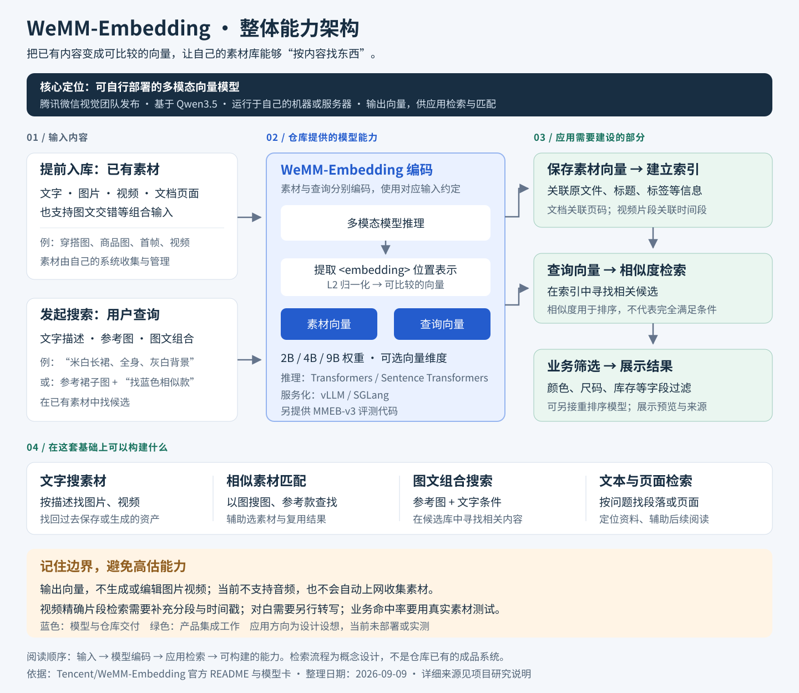
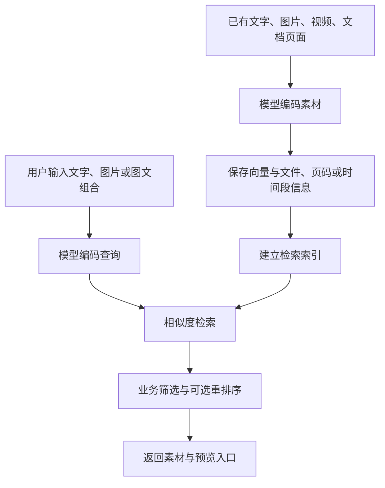

# WeMM-Embedding：能力、应用边界与同类方案

**WeMM-Embedding 是可以自行部署的多模态向量模型，用于把文字、图片、视频和文档页面转换成可比较的向量，为语义搜索与内容匹配提供基础能力。**

| 项目 | 说明 |
| --- | --- |
| 官方仓库 | [Tencent/WeMM-Embedding](https://github.com/Tencent/WeMM-Embedding) |
| 发布团队 | 腾讯微信视觉团队 |
| 整理与核对日期 | 2026-09-09 |
| 研究目标 | 理解模型定位、素材检索用途，以及与同类方案的区别 |
| 状态 | 已完成资料整理；未部署模型或开展业务实测 |
| 资料依据 | 用户提供的 GPT 分析记录、官方 README、模型卡与相关产品文档 |

本文为独立研究笔记。模型能力依据官方资料；穿搭素材应用与选型建议是接入设想，不代表仓库已经实现这些产品功能。

## 整体架构：先看这张图

按 **输入内容 → 模型编码 → 应用检索 → 可构建的功能** 阅读。蓝色是仓库提供的模型与推理能力，绿色是接入产品时需要建设的部分。

- **模型负责：**把文字、图片、视频、文档页面和组合输入转换为可比较的向量。
- **我们需要补充：**素材管理、索引、相似度检索、业务筛选与预览；视频片段定位还需要分段和时间戳。
- **后期用途：**按描述找素材、以图找相似款、图文组合查询、检索资料页面，辅助参考选择与资产复用。

[查看可缩放原图](assets/architecture.svg) · [下载 PNG 图片](assets/architecture.png)。这是对官方能力与产品接入设计的归纳，未部署或实测。

## 1. 它解决什么问题

当素材库积累了大量图片、视频和文档，而文件名只是时间戳或编号时，可以利用模型按内容查找素材。例如：

> 找之前保存过的米白色无袖长裙、全身站姿、灰白背景素材。

模型将查询和候选素材编码成向量，检索系统再根据相似度返回候选结果。模型本身输出的是向量，文件管理、检索索引、条件筛选与结果页面需要另外实现。[官方介绍与推理示例](https://github.com/Tencent/WeMM-Embedding)

“本地模型”描述的是一种部署方式：既可以在自己的机器上运行，也可以部署到服务器供应用调用。其核心价值是内容表示与匹配。

与前一项 [OpenHiggsfield 研究](../009-open-higgsfield/README.md) 的关系：OpenHiggsfield 提供调用外部生成服务的工作台；WeMM-Embedding 提供检索所需的模型能力。前者帮助产生素材，后者可用于组织和复用已有素材。

## 2. 支持的输入与可构建的功能

官方列出的输入包括文字、图片、视频、视觉文档，以及交错组合的多模态内容。[官方能力说明](https://github.com/Tencent/WeMM-Embedding#model-zoo)

| 应用方向 | 穿搭或资料场景示例 | 产品侧需要补充什么 |
| --- | --- | --- |
| 文字搜图片、视频 | 查找“穿长裙的人在影棚中展示服装” | 素材入库、向量索引和结果展示 |
| 以图搜图 | 上传参考服装图，寻找视觉或款式相近的商品 | 候选商品库、商品信息与筛选规则 |
| 文本语义检索 | 根据问题查找相关说明段落 | 文档切分、来源关联和检索服务 |
| 文档页面检索 | 在带图片、表格与排版的资料中查找相关页面 | 文档转页面图、页码关联和预览 |
| 图片与文字组合查询 | 提供裙子参考图，补充“寻找蓝色的相似款式” | 图文查询入口与候选素材匹配 |

这些例子说明如何利用模型，并不保证每项复杂条件都能准确命中。“寻找蓝色版本”是在已有商品中检索候选，不会修改参考图的颜色。

## 3. 从向量到搜索产品

Embedding 可以理解为内容的“语义坐标”。描述相近场景的文字、图片或视频，被转换为可在同一表示空间中比较的数字序列。相似度用于排序，不是模型对业务事实的证明。

下面是接入设计示意：

模型负责生成内容表示；应用负责决定搜索哪些数据、如何更新索引、怎样筛选与展示。查询与素材的编码应遵循模型提供的对应接口及预处理约定。

如果要定位“人物转身展示裙子”的具体时间段，通常还需要把视频分段编码，并保存片段起止时间。能够编码视频，不等于已经提供完整的片段定位产品。

## 4. 模型本身与开放内容

WeMM-Embedding 基于 Qwen3.5 构建，使用模型推理生成向量，并非把请求转发给 Qwen 或腾讯的在线 API。模型卡提供直接加载权重的示例；向量取自专用 `<embedding>` 位置的最后一层表示，并经过 L2 归一化。[官方模型卡](https://huggingface.co/tencent/WeMM-Embedding-2B)

模型项目的重要成果包括训练后的权重，不能仅凭推理封装代码的长短判断技术含量。

| 开放内容 | 说明 |
| --- | --- |
| 模型权重 | 2B、4B、9B 三个规格 |
| 推理示例 | Transformers、Sentence Transformers |
| 服务化方式 | vLLM、SGLang 相关启动方式与脚本 |
| 评测代码 | MMEB-v3 评测流程 |

| 模型规格 | 完整向量维度 | 官方支持的向量维度 |
| --- | --- | --- |
| 2B | 2048 | 64、128、256、512、1024、2048 |
| 4B | 2560 | 64、128、256、512、1024、2560 |
| 9B | 4096 | 64、128、256、512、1024、2048、4096 |

来源：[官方模型列表与部署说明](https://github.com/Tencent/WeMM-Embedding)。降低输出维度主要节省向量存储与检索成本，不等于缩小模型权重。使用受支持的较低维度时，需要按官方方式截取并重新归一化。

部署入口见 [Transformers 示例](https://github.com/Tencent/WeMM-Embedding/blob/main/examples/transformers_inference.py) 和 [Sentence Transformers 示例](https://github.com/Tencent/WeMM-Embedding/blob/main/examples/sentence_transformers_inference.py)。本次未测量显存、吞吐量或运行兼容性，硬件选型需结合模型规格、输入长度、视频帧数与批量大小验证。

## 5. 如何理解效果与边界

官方 MMEB-v2 表格报告：WeMM 2B 综合分数为 77.9，4B 为 79.2，9B 为 80.6；同表 Qwen3-VL-Embedding-8B 为 77.8。该基准混合使用图像／视频的 Hit@1 与视觉文档的 NDCG@5，不能把综合分数写成“搜索准确率 80.6%”，也不能直接推导到服装业务效果。[官方评测表](https://github.com/Tencent/WeMM-Embedding#evaluation)

使用时需要区分以下边界：

- **生成与编辑：**输出向量，不直接生成换装图片、剪辑视频或撰写分析报告。
- **声音理解：**官方当前不支持音频输入。需要检索对白时，可另行转写并索引文本；环境声音还需要音频模型处理。
- **确定性条件：**高相似度不能证明是同一件衣服，或完全满足颜色、尺码、库存等条件。明确字段应配合业务过滤。
- **素材来源：**搜索范围由接入系统提供，不会自动上网收集资源。
- **模型更换：**不同模型的向量通常不能混用，即使维度相同。除非官方明确保证共享向量空间，否则应规划重新编码和索引迁移。

## 6. 同类模型、产品与云服务

这些方案位于不同层次：模型负责编码，成品提供管理与搜索体验，云服务提供远程计算或托管检索。应先确定需要哪一层能力，再比较效果与成本。

### 可自行部署的模型与工具库

| 方案 | 定位与主要能力 | 对本研究的参考价值 |
| --- | --- | --- |
| [Qwen3-VL-Embedding](https://github.com/QwenLM/Qwen3-VL-Embedding) | 图文、截图、视频与混合输入；提供 2B、8B 规格及配套 Reranker | 与 WeMM 接近，适合在同一批素材上对照测试 |
| [Jina Embeddings v5-omni-small](https://huggingface.co/jinaai/jina-embeddings-v5-omni-small) | 支持文字、图片、视频、音频的向量表示 | 需要声音检索时可进一步评估；模型卡标注 CC BY-NC 4.0，商用需另行取得授权 |
| [Google SigLIP 2](https://huggingface.co/google/siglip2-base-patch16-224) | 图文匹配、图片表示与零样本分类 | 以图片搜索为主时的候选模型路线 |
| [OpenCLIP](https://github.com/mlfoundations/open_clip) | 加载、训练和使用 CLIP 类模型的工具库 | 研究图文搜索实现与不同预训练模型 |

Reranker 的作用是：先由 Embedding 检索少量候选，再把查询与候选配对评分，重新排序。这可能改善相关性，也会增加计算量；例如“从十万张图中召回一百张再精排”只是设计示例，不是固定限制。[Qwen 官方说明](https://github.com/QwenLM/Qwen3-VL-Embedding#overview)

SigLIP 2 是模型系列，OpenCLIP 是工具库。给图文模型输入视频抽帧，也不能据此推断它理解了整段视频的动作顺序或声音。

### 已经提供搜索体验的产品

| 产品 | 提供的体验 | 适合参考什么 |
| --- | --- | --- |
| [Immich](https://docs.immich.app/features/searching/) | 自建照片／视频管理中的语义搜索，可选择多语言模型 | 导入、索引、搜索、筛选与浏览如何连起来；中文使用应验证模型选择 |
| [Ente Photos](https://ente.com/help/photos/features/search-and-discovery/magic-search) | Magic Search 在设备端分析与匹配照片内容，索引加密保存 | 自然语言照片搜索与隐私设计；官方说明英语通常效果更好 |

管理视频、搜索到某个视频、定位视频里的特定片段，是不同需求，不能因为一个产品支持视频文件就视为全部具备。

### 云端接口与视频搜索服务

| 服务 | 主要能力 | 仍需考虑的接入工作 |
| --- | --- | --- |
| [Google Gemini Embedding 2](https://ai.google.dev/gemini-api/docs/embeddings) | 通过 API 对文字、图片、视频、音频和 PDF 生成向量 | 组织索引、检索、文件关联和产品界面 |
| [TwelveLabs／Marengo](https://docs.twelvelabs.io/docs/concepts/models/marengo) | 面向视频的多模态表示；平台提供视频索引和搜索能力 | 根据所选 API 接入素材上传、索引、片段结果与播放器 |

涉及画面、动作、对白或声音的视频片段搜索，可以把 TwelveLabs 纳入评估。具体输入、片段粒度与服务限制，应按所用模型及接口版本确认。

## 7. 穿搭素材库的接入建议

以下是后续可选的验证路线，本次没有实施：

1. **先验证图片搜索。** 准备有代表性的服装图、人物图和首帧，建立包含颜色、款式、姿态、背景的真实中文查询集。
2. **统一对照测试。** 在同一批素材和人工标注结果上比较 WeMM 与 Qwen3-VL-Embedding，记录前若干条结果的相关性、查询延迟、入库速度和资源消耗。
3. **补充结构化信息。** 保存商品编号、颜色、尺码等明确字段，让语义检索与业务过滤配合工作。
4. **按需求扩展视频。** 若目标是找具体动作，增加分段与时间戳；若需要对白或声音，再增加对应处理链路。

如果主要目的是体验完整素材产品，可以先看 Immich；如果主要目的是开发混合素材搜索，可先比较 WeMM 与 Qwen；如果重点是视频片段检索，可先评估 TwelveLabs 的现有服务。

WeMM 对穿搭工作流最直接的潜在价值，是帮助查找参考、选择素材、复用已有结果。它本身不会提高换装生成模型的画质或动作执行能力。

## 8. 来源与维护

本文合并了原分析中的重复问答，保留能力解释、应用例子及同类方案，并根据官方资料核对模型规格与主要边界。文中链接可能随上游更新，后续接入时应重新确认。

- [WeMM 官方中文 README](https://github.com/Tencent/WeMM-Embedding/blob/main/README_zh.md)
- [WeMM-Embedding-2B 模型卡与推理示例](https://huggingface.co/tencent/WeMM-Embedding-2B)
- [WeMM 技术报告入口](https://arxiv.org/abs/2608.24053)
- [WeMM MMEB-v3 评测说明](https://github.com/Tencent/WeMM-Embedding/tree/main/mmeb_v3_eval)

本次仅整理文档与官方报告的结果，没有复现评测，也没有验证穿搭素材上的检索质量。“已完成”指资料整理完成。
