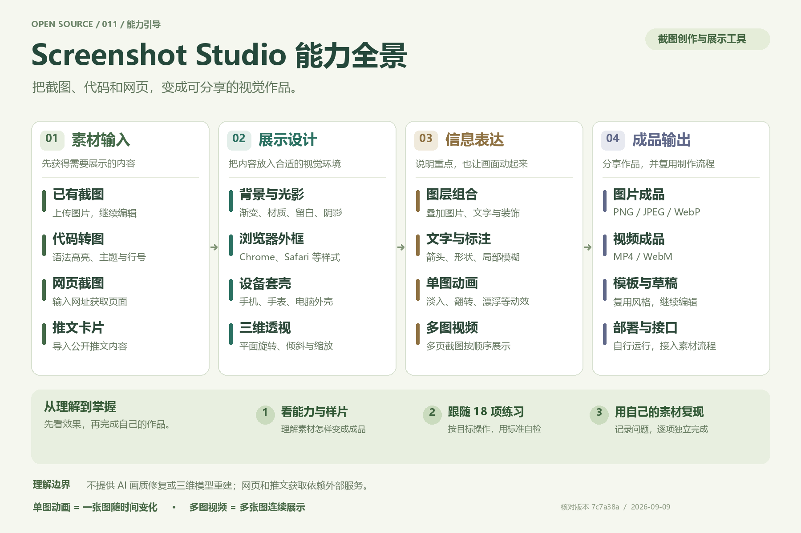
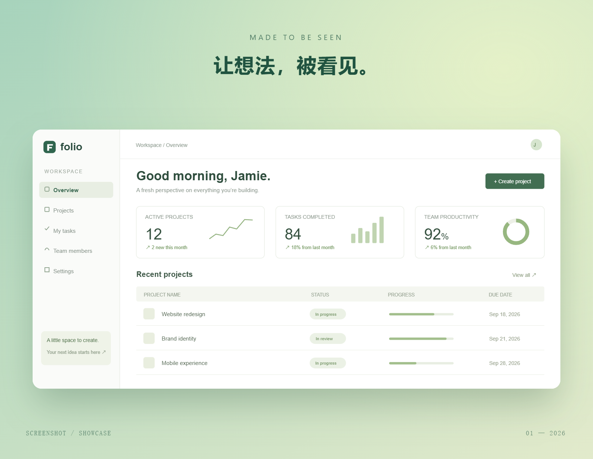
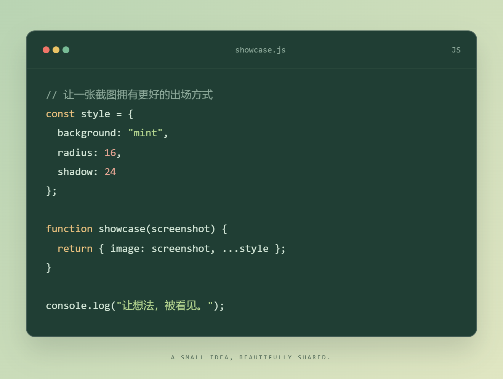
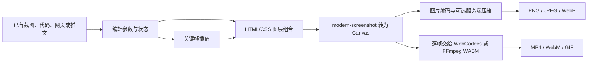

# 011 · Screenshot Studio：能力全景与学习工作台

**将已有截图包装成适合展示、说明和传播的素材。** 核心是背景、外框、光影、标注和动效；不包含 AI 画质修复、去模糊或内容重建。

| 项目 | 内容 |
| --- | --- |
| 上游仓库 | [opennookorg/screenshot-studio](https://github.com/opennookorg/screenshot-studio) |
| 核对版本 | `7c7a38a65a547aa081cb86bf489d27be44aeb4f7`（提交日期 2026-09-08 UTC） |
| 研究日期 | 2026-09-09 |
| 上游许可证 | Apache-2.0 |
| 研究状态 | 已运行原版完整应用，提供 18 项体验路线与真实导出样片；保留独立入门演示 |
| 原版工具 | [在线编辑器](https://www.screenshot-studio.com/) · [代码卡片](https://www.screenshot-studio.com/code) |
| 本地展示源码 | [Web 子项目](../../web/011-screenshot-studio/index.html) |
| 技术栈 | 上游：Next.js、React、TypeScript、Zustand、modern-screenshot、WebCodecs、FFmpeg WASM；本页：HTML/CSS/JavaScript、modern-screenshot |

## 一张图理解这个库



[下载高清 PNG](assets/capability-map.png) · [查看可编辑 SVG](assets/capability-map.svg) · [主页源码](../../web/011-screenshot-studio/index.html)

**它是一套截图与内容展示创作工具。** 除了基础图片处理、多图视频，还包含代码转图、网页获取、推文卡片、设备套壳、三维透视、多图层、教程标注、单图动画、模板复用与自行部署。

| 环节 | 能力汇总 | 主要价值 |
| --- | --- | --- |
| 素材输入 | 上传截图、代码转图、网页截图、公开推文导入 | 从多种来源获得可展示的内容 |
| 展示设计 | 背景、光影、浏览器外框、设备套壳、平面三维透视 | 将原始内容组织为产品展示画面 |
| 信息表达 | 文字、箭头、形状、局部模糊、图片图层、单图动画、多页展示 | 说明重点，组合素材，控制展示节奏 |
| 成品输出 | PNG / JPEG / WebP、MP4 / WebM、模板与草稿、部署与接口 | 分享作品，复用设计，接入工作流程 |

单图动画让一张截图随时间变化；多图视频把多张截图连续展示。原版入口、验证范围和外部依赖见下文。

## 在主页看全能力并练习

[打开完整体验路线](http://127.0.0.1:8011/index.html#journey) · [原版截图编辑器](http://127.0.0.1:3011/) · [原版代码卡片](http://127.0.0.1:3011/code)

原版已在本机运行。主页直接展示 18 项能力、操作路径、练习目标、完成标准、常见问题、个人学习进度与笔记，附原版 JPEG / PNG / MP4 输出样例。涵盖输入、背景、外框、设备、三维、图层、标注、滤镜、时间轴、多页、代码、导出、模板和接口。

[原版运行与验证详情](notes/original-app.md) · [播放实际导出的 3 秒动画](assets/original-animation.mp4) · [查看原版代码卡片](assets/original-code.png)

当前主界面提供 1× / 2× / 3× 图片、MP4 / WebM 视频和 14 种代码主题。README 中的 5×、GIF、32 主题与实际入口存在差异，详见验证详情。全量入口已开放，不表示全部参数组合均已实测。

### 如何用主页完善自己的能力

1. 看原版实际输出，下载练习截图。
2. 浏览六个分类的 18 项能力，展开卡片的“练习与自检”。
3. 按练习目标在原版操作，用完成标准检查作品。
4. 尝试过勾选“已体验”；能自行复现后再勾选“可独立完成”。
5. 记录作品、问题与下一步改进；使用“需要巩固”筛选和“下一项建议”继续学习。

原来的体验勾选会继续保留。学习记录仅在当前浏览器保存；清空学习进度不会删除练习笔记。

## 入门演示的实际效果

下图是**本项目原创演示实际导出的 PNG**，不是上游产品界面截图。原始素材为本项目绘制的虚构 Folio 工作台，数据仅用于展示。



[查看窗口外框效果](assets/frame.png) · [查看透视效果](assets/perspective.png) · [查看标注效果](assets/annotate.png)

页面支持切换五种截图表达、前后对比、五种背景、四种外框、留白／圆角／阴影／透视调整、标题编辑、本地截图替换和 2× PNG 导出。标注支持修改文字和水平／垂直位置。动态模式提供 4 秒入场动画、播放／暂停和时间轴拖动，保存当前静帧。

### 前两轮入门演示补充

- **代码卡片：**编辑代码与文件标题，选择 JavaScript／Python／JSON，切换森林绿、午夜蓝、浅纸色三种主题，浏览器内导出 2× PNG。
- **可编辑标注：**修改一组文字与箭头的位置，导出保留调整结果。
- **成品对照：**原始界面与四张实际导出图并排比较，说明各项包装的作用。
- **场景起点：**产品发布、教程说明、社交分享三种风格，一键套用后继续微调，保留当前截图。
- **问题解答：**说明修复与美化、应用与工具库、5× 与超分辨率、浏览器与服务器的分工。



[查看 Python 午夜蓝卡片](assets/code-python.png) · [阅读操作与场景指南](notes/usage-guide.md)

## 能力、实现与场景

| 能力 | 原库提供什么 | 如何实现 | 适合的场景 |
| --- | --- | --- | --- |
| 截图美化 | 100 多种背景素材／预设，渐变、噪点、模糊、圆角、阴影 | HTML/CSS 组合与图像后处理 | 官网配图、产品发布、文章插图 |
| 窗口外框 | Safari、Chrome、Arc、macOS、拍立得、玻璃等风格 | 截图外增加装饰图层 | 软件展示、作品集 |
| 三维透视 | 旋转、位移、缩放、透视、投影 | CSS `perspective` 与 `rotateX/Y/Z` | 产品首屏、宣传图 |
| 标注 | 箭头、形状、文字、图片叠加、局部模糊 | HTML/SVG 图层及 Canvas 后处理 | 教程、反馈、重点说明 |
| 代码／推文转图 | 代码语法高亮（当前代码页 14 主题），推文素材导入 | 先形成排版内容，再转成图片 | 技术博客、社交分享 |
| 网页截图 | 输入网址，选择桌面／移动等参数获取截图 | 服务端调用 Microlink，再获取图片 | 公开网页展示 |
| 动画与时间轴 | 20 多种预设、关键帧和多页展示 | 参数插值、逐帧渲染、视频编码 | 入场动画、轻量产品动效 |
| 导出 | 主界面 PNG、JPEG、WebP / 1× 至 3×；MP4、WebM；GIF 存在底层路径 | DOM 转 Canvas，图片编码或逐帧编码 | 图片素材、短视频 |

功能清单依据[固定版本 README](https://github.com/opennookorg/screenshot-studio/blob/7c7a38a65a547aa081cb86bf489d27be44aeb4f7/README.md)，具体实现入口见[源码核对记录](notes/source-audit.md)。背景数量属于上游声明，未逐个验证；代码页主题与导出选项已按实际界面校正。

## 整体原理



- **画布：**当前 HTML 容器替代旧的 Konva Stage。背景、截图、外框和叠加元素由网页样式组合，Zustand 保存编辑状态。
- **透视：**旋转的是二维截图平面。立体感来自投影与透视，不会生成界面内部物体的背面或可交互三维模型。
- **图片：**`domToCanvas()` 捕获画面，过滤编辑控件，并补做局部模糊等不易直接导出的 CSS 效果。
- **动画：**关键帧描述某时刻的旋转、位置、缩放与透明度。插值计算中间状态，再渲染与编码。

### 原库与本页的处理路径不同

上游普通图片导出默认尝试把合成图片发送到自身 `/api/export`，由服务端 Sharp 压缩；失败后回退浏览器编码。网址截图调用 Microlink 外部服务。因此，不能把原版“浏览器编辑”直接解释成“所有处理均不离开本地”。

**本页独立演示的图片导出只在浏览器编码，不调用这两个服务。** 自选图片使用临时 Blob URL，替换或重置时释放，不保存到服务端；刷新后编辑状态不保留。

### 文档与源码差异

`ARCHITECTURE.md` 仍包含 Konva、html2canvas 和自动加水印等旧描述。当前画布与导出代码已经改变，README 也声明无水印。本研究以固定版本实际调用链为准，不能单凭旧架构文档推断当前行为。

## 基础实验页的演示范围

| 功能 | 本页 | 原版 |
| --- | --- | --- |
| 背景、外框、圆角、阴影、标题、透视 | 可操作的原创简化实现 | 完整编辑器与更多风格 |
| 原图对比、本地截图替换 | 可操作 | 以原版当前界面为准 |
| 箭头／标注 | 单组文字可编辑，位置通过滑杆调整；不支持自由绘制／多组新增 | 提供更完整的编辑能力 |
| 动画 | 4 秒单次入场，播放／暂停、时间轴 | 更多预设、关键帧、多页能力 |
| 导出 | 截图 1600 × 1240 PNG；代码卡片宽 1320、高度随内容变化 | 更多图片与视频格式 |
| 代码卡片 | 三种语言示例、基础高亮、三种主题、标题编辑与 PNG 导出 | 更多语法主题和排版设置 |
| 推文、网址导入 | 说明与原版入口，未接入在线获取 | 由原版相应功能提供 |

基础实验页使用 `modern-screenshot` 完成简化演示的真实 PNG 导出。主页完整能力区直接连接独立运行的原版 Next.js 应用；原版图片与 MP4 已实际验证，两套体验在页面中明确标识。

## 运行与维护

原版完整应用：

```powershell
./projects/011-screenshot-studio/experiments/start-original.ps1
```

打开 [原版编辑器](http://127.0.0.1:3011/)。首次需要安装依赖并编译页面；当前已启动。详见 [运行说明](notes/original-app.md)。


从总仓库根目录启动独立演示：

```sh
python -m http.server 8011 --bind 127.0.0.1 --directory web/011-screenshot-studio
```

打开 <http://127.0.0.1:8011/>。浏览器资源随子项目本地提供，运行无需 npm 安装。建议通过 HTTP 预览，以避免直接打开文件时的图片捕获限制。

加入统一站点：

```sh
python scripts/build.py
python -m http.server 8000 --bind 127.0.0.1 --directory _site
```

本地统一入口为 <http://127.0.0.1:8000/demos/011-screenshot-studio/>。公开站点需要按总仓库部署流程另行发布，本次不代表已经上线。

文件说明：

- `web/011-screenshot-studio/index.html`、`tour.js`、`homepage-tour.css`：主页完整能力、练习、自检、笔记、双阶段学习进度和原版入口。
- `web/011-screenshot-studio/full-tour.html`：兼容旧链接，自动进入主页能力区。
- `experiments/start-original.ps1`、`configure-local.mjs`：原版启动与本地适配。
- `assets/original-*`：原版实际导出的图片与动画。
- `web/011-screenshot-studio/index.html`：基础能力导览与简化实验。
- `web/011-screenshot-studio/style.css`：响应式布局、背景、外框、透视与标注。
- `web/011-screenshot-studio/app.js`：交互、图片读取、动画和 PNG 导出。
- `web/011-screenshot-studio/extensions.js`：代码高亮、卡片导出、成品对照和场景风格。
- `web/011-screenshot-studio/assets/sample.svg`：原创虚构界面。
- `web/011-screenshot-studio/vendor/`：固定版本导出依赖与 MIT 许可。
- `assets/*.png`：从本页实际导出的截图展示图与代码卡片。
- `web/011-screenshot-studio/assets/gallery/`：前后对照用的固定导出样例，上传个人图片不会替换它们。
- [验证记录](notes/validation.md)：检查步骤、结果与未测范围。

## 研究结论

适用于**已有截图 → 更好的展示素材**这一步。产品发布、教程、技术内容和轻量动效都可以受益。若需要去模糊、超分辨率、内容修补、真正的三维重建或复杂视频剪辑，需要其他工具。

可参考的工程设计包括：用网页样式实现可编辑图层、统一预览和导出、处理 CSS 捕获差异、将动画拆成参数插值与视频编码。自行部署时，需要单独核对服务端压缩、截图接口、外部素材与存储依赖。

## 来源与许可

本说明、展示页面与 Folio 示例为原创研究材料。原版源码在忽略目录中克隆运行；新增原版导出样片使用上游背景和外框，素材来源与许可随页面记录。源码引用链接固定到研究 commit；上游仓库采用 [Apache-2.0](https://github.com/opennookorg/screenshot-studio/blob/7c7a38a65a547aa081cb86bf489d27be44aeb4f7/LICENSE)。

能力引导图为本研究原创，用可维护的结构化图形排版生成，提供 1800 × 1200 PNG 和 SVG；生成入口为 `experiments/build-capability-map.py`。

本地包含 `modern-screenshot@4.6.6` 官方 npm 包中的浏览器发行文件，采用 [MIT 许可证](../../web/011-screenshot-studio/vendor/LICENSE.txt)。它是本页真实图片导出的运行依赖，来源与校验值见 [THIRD_PARTY.md](../../web/011-screenshot-studio/THIRD_PARTY.md)。
