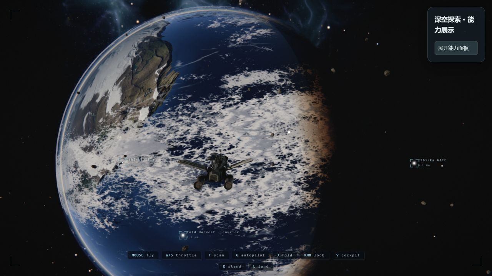
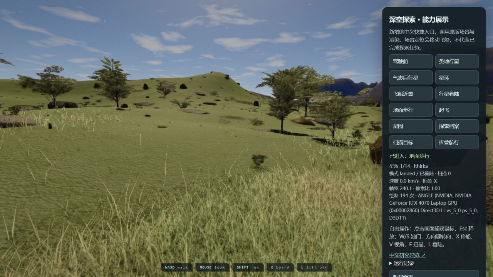
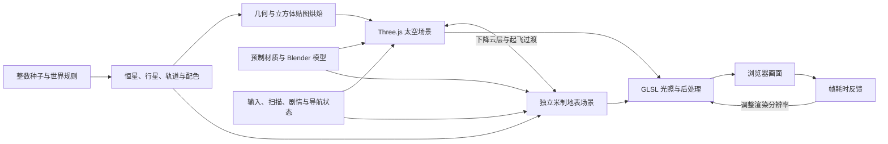
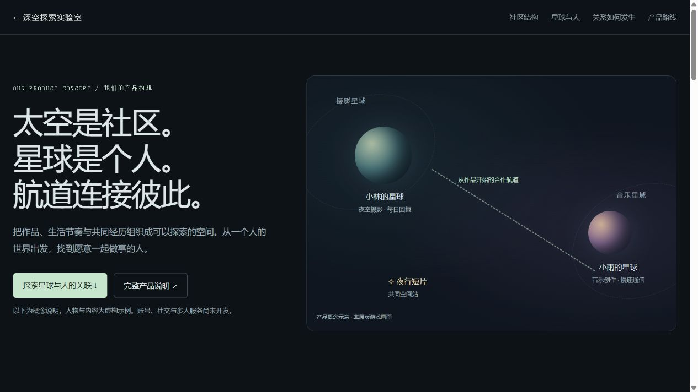

# 012 · The Long Silence：深空探索与渲染研究

**已在本机运行原版浏览器太空探索游戏，并增加独立中文能力面板与研究导览。** 最值得借鉴的是确定性世界生成、行星烘焙、大尺度坐标处理、太空／地表场景切换和资源复用。

| 项目 | 信息 |
| --- | --- |
| 来源 | [achimala/TheLongSilence](https://github.com/achimala/TheLongSilence) |
| 固定版本 | `69b3296b4b6ecb3ca75ed6193e4b785c4c791c0f` |
| 提交时间 | 2026-09-03 16:42:07 +02:00 |
| 研究日期 | 2026-09-09 |
| 上游许可证 | MIT，Copyright 2026 Anshu Chimala |
| 技术栈 | JavaScript、Three.js 0.185.1、WebGL2、GLSL、Vite 8.1.5；资产工具包含 Python、Blender 和图像生成流程 |
| 交付形式 | 完整游戏源码；没有面向外部业务的稳定 SDK 接口 |
| 实测范围 | 原版启动、场景与交互，见[验证记录](notes/validation.md)；完整剧情未通关 |

## 从哪里开始

- [公开效果与原理导览](https://yydshly.github.io/0908_codex_project/demos/012-the-long-silence/)：五组真实截图、可点击技术流程、14 星系目录与扩展方向，无需运行游戏。
- [太空社区产品构想](https://yydshly.github.io/0908_codex_project/demos/012-the-long-silence/community.html)：社区结构、星球元素与人的关联、关系形成过程及首版路线。
- [完整产品说明](notes/community-product.md)：整理我们的个人空间、关系与社区理解；这些业务功能尚未实现。

以下入口需先完成[本机启动](#运行与复现)：

- [本机中文导览](http://127.0.0.1:8012/)：包含本机游戏快捷入口。
- [中文能力体验](http://127.0.0.1:5112/lab.html)：加载后点击 WAKE，再用右侧面板进入各个场景。
- [已验证的地表体验入口](http://127.0.0.1:5112/lab.html?q=low&groundfast=1)：低画质，点击「行星着陆」直接建立地表，再点击「地面步行」。此入口跳过正常下降和预编译等待。
- [原版游戏](http://127.0.0.1:5112/)：保留原来的舱内起步与探索流程。
- [渲染诊断入口](http://127.0.0.1:5112/lab.html?msaa=0&ao=0)：关闭 MSAA 与环境遮蔽，用于判断画面负载；效果与默认设置不同。

公开站点提供研究导览与产品概念展示，完整游戏只在本机运行；未将游戏资源或社交服务部署到远端。



## 原版能力和本研究新增内容

| 能力 | 原版实现 | 本研究提供 |
| --- | --- | --- |
| 程序化宇宙 | 按种子生成星系、行星、卫星、环、轨道与配色 | 固定种子生成审计和可切换星系目录 |
| 飞船与驾驶舱 | 舱内行走、驾驶座交互、飞行、外部视角 | 驾驶座和外部取景快捷入口 |
| 行星与星环 | 自定义 GLSL 表面、大气、云层与星环 | 原版实时场景与实测截图 |
| 扫描与档案 | 对准目标、按住扫描、增加发现、推进指令和升级 | 调用原版持续扫描输入通路；不直接发放发现 |
| 折叠与星际跳跃 | 距离相关速度、电量消耗、星图选择与跳跃 | 折叠展示入口会补满电量；普通星图仍沿用原版交互 |
| 地面探索 | 下降过渡、独立地表场景、步行与起飞 | 地表及拍摄站位入口，实际结果见验证记录 |
| 剧情 | 七共振器、Canto 与 Aperture 进度 | 仅说明实现；没有宣称已完成通关 |

面板调用 `pose()`、`inspect()` 等上游已经存在的研究辅助方法。它会移动飞船，某些入口会调整相机或补充电量；这是能力展示快捷方式，不能当作普通玩家流程的完整端到端测试。面板通过独立 `lab.html` 注入，未改动上游受版本控制的游戏代码。

**实测发现：正常着陆在本次浏览器环境中停留于云层交接阶段。** 使用上游 `land({now:true})` 辅助入口后，地形、草木、EVA 步行视角和返回太空均已运行。保留正常入口供进一步排查，不把诊断成功等同于正常流程已修复。



## 能力原理



### 1. 确定性生成，而非每次请求 AI

`generateGalaxy(seed, count)` 使用 `mulberry32` 产生可重复的随机序列。`generateSystem(stub)` 决定恒星参数、行星类型、卫星、轨道、配色、气氛和小行星带。规则也有艺术约束，例如起始星系保证有宜居世界、调整星环倾斜以表现光影。

本次直接执行上游函数：种子 `20260725`、14 个星系，生成 **78 颗行星、102 颗卫星**。同种子生成一致，不同种子输出不同；起始星系具有花园行星。实际默认行星类型为沙漠、类地、气态、荒芜、冰冻、有毒、富铁；源码支持更多类型，不代表每个种子都出现全部类型。详见[机器可复核结果](notes/generation-audit.json)。

这里的“可重复”以相同代码和参数为前提。新增一次随机抽样可能改变后续整个序列，因此扩展存档时需要同时保存生成器版本。

### 2. 行星烘焙，把昂贵计算移出逐帧路径

复杂噪声决定地貌、颜色和高度，预先写入 Cubemap。运行时查询贴图，并结合光照得到表面外观。Cubemap 用方向查询，避免普通经纬度贴图的极点挤压；仍需正确处理面边界、采样和法线。

近处世界可以提高贴图分辨率。几何按材质合并，重复物体共享模型或使用实例化，以减少绘制调用和重复资源。地面实例位置也通过专门的 GPU 放置过程计算，避免每个顶点反复查询完整地形。

### 3. 太空与地面分开处理精度

太空以公里为主要单位，飞船绝对位置保存于状态，每帧把其他物体换算到飞船附近的相对位置。对数深度缓冲改善极大远近距离范围中的遮挡精度。

地面独立使用米制场景、径向地形网格和相应相机范围。着陆过程中准备网格、材质与着色器，用云层遮挡场景交换。视觉上形成连续下降体验，内部仍是两个场景。共享飞船材质在切换时也必须使用匹配的深度编码。

### 4. 光照、后处理和性能取舍

大气通过球壳内光线步进近似散射，结合恒星方向形成昼夜边缘。舱内包含窗框阴影、体积光与局部灯光。后处理负责曝光适应、泛光、镜头条纹／眩光、色调映射、颗粒与抗锯齿。

引擎根据观测帧率调整分辨率。**源码存在最低分辨率限制，不能保证所有硬件或场景稳定 60fps。** 这个版本的 `Engine.js` 已和 README 中“0.62×–2×”的概述有所差异，应以源码的 `prFloor`、`prCeil`、`superSample` 为准。

交通船沿时间驱动的解析路径运行。这样跳跃或暂停后可以直接计算位置，无需持续积分完整模拟；远处信标还会保持最小屏幕像素尺寸，让系统看起来有活动。

### 5. AI 在制作环节的位置

仓库说明声称游戏由 Claude Opus 5 制作，这是作者的项目描述，本研究没有独立验证模型归因。可检查到的资产工具包括：图像生成制作基础材质，Python 派生高度／法线／粗糙度等数据，Blender 生成飞船和舱内模型。`gen_material.py` 包含通过 `codex exec` 驱动制作的流程。

游戏运行时使用随仓库提供的现成资源；此次启动没有调用这些生成工具、没有使用模型 API 密钥。它不是具备运行时大模型 NPC 的引擎。

## 源码阅读顺序

以下链接固定到本次核对版本。

| 入口 | 负责什么 | 借鉴点 |
| --- | --- | --- |
| [main.js](https://github.com/achimala/TheLongSilence/blob/69b3296b4b6ecb3ca75ed6193e4b785c4c791c0f/src/main.js) | 设备检查、启动与帧循环 | 启动过程和页面生命周期 |
| [generate.js](https://github.com/achimala/TheLongSilence/blob/69b3296b4b6ecb3ca75ed6193e4b785c4c791c0f/src/world/generate.js) | 宇宙生成 | 种子、规则、艺术约束 |
| [Game.js](https://github.com/achimala/TheLongSilence/blob/69b3296b4b6ecb3ca75ed6193e4b785c4c791c0f/src/game/Game.js) | 游戏状态、扫描、跳跃、着陆和相机 | 完整运行路径，也体现集中式类的维护成本 |
| [Engine.js](https://github.com/achimala/TheLongSilence/blob/69b3296b4b6ecb3ca75ed6193e4b785c4c791c0f/src/core/Engine.js) | 渲染器和动态分辨率 | 自适应质量与诊断开关 |
| [cubeBake.js](https://github.com/achimala/TheLongSilence/blob/69b3296b4b6ecb3ca75ed6193e4b785c4c791c0f/src/gfx/cubeBake.js) | 渲染立方体贴图 | 将重复计算预计算 |
| [Surface.js](https://github.com/achimala/TheLongSilence/blob/69b3296b4b6ecb3ca75ed6193e4b785c4c791c0f/src/world/Surface.js) | 地形、材质与植被 | 局部地表、多尺度细节与实例放置 |
| [PostFX.js](https://github.com/achimala/TheLongSilence/blob/69b3296b4b6ecb3ca75ed6193e4b785c4c791c0f/src/gfx/PostFX.js) | 曝光和画面后处理 | 明暗适应、效果链与带宽成本 |
| [Fleet.js](https://github.com/achimala/TheLongSilence/blob/69b3296b4b6ecb3ca75ed6193e4b785c4c791c0f/src/world/Fleet.js) | 飞船交通 | 解析运动与远距离可见性 |
| [tools](https://github.com/achimala/TheLongSilence/tree/69b3296b4b6ecb3ca75ed6193e4b785c4c791c0f/tools) | 资产制作、截图和交互检查 | 可重复构图与测量；部分工具包含 macOS Metal 参数，Windows 不能直接照抄 |

## 我们理解的产品价值：从宇宙探索到人与人的连接

**太空是社区，星球是个人，航道是交互。** 个人星球承载作品与故事；主题星域帮助人发现彼此；围绕具体内容建立的航道，让讨论进一步成为持续交流或合作。

[](https://yydshly.github.io/0908_codex_project/demos/012-the-long-silence/community.html)

- **个人表达：**地貌表达兴趣，自转表达自选的回复节奏，昼夜表达勿扰时间，大气表达内容开放范围，卫星承载项目。
- **相互关系：**双方接受邀请建立航道，轨道表达约定的交流节奏，星星记录共同经历；关系可以暂停或退出。
- **社区共创：**从发布作品／需求，到发现、讨论、建立航道，再到共同空间站里的成果；成果回到各自星球。
- **产品组合：**创作者社区、个人数字空间、朋友／伴侣小宇宙、兴趣俱乐部、学习社区和团队项目空间。

这些是我们的设计提案，尚未开发或验证需求。原库可参考视觉与空间组织；账号、内容、消息、服务端权限和协作系统需要新增。首版先验证社区内容与交流闭环，三维飞行和着陆作为后续可选体验。

[查看交互式产品构想 →](https://yydshly.github.io/0908_codex_project/demos/012-the-long-silence/community.html) · [完整元素映射、使用案例与首版验收 →](notes/community-product.md)

## 可扩展方向

这些是基于源码的建议，除本次中文面板外尚未实现，不是上游已有功能清单。

| 优先级 | 方向 | 复用内容 | 需要新增 | 验收标准 |
| --- | --- | --- | --- | --- |
| P1 | 本地存档 | 种子、发现、剧情和飞船状态 | IndexedDB、存档版本、恢复顺序与迁移 | 刷新后回到同一星系，已扫描目标和升级正确恢复 |
| P1 | 中文化和新手指引 | HUD、Codex、directives | 文本资源表、术语、新手路径和输入冲突处理 | 无需开发者辅助完成驾驶、扫描和第一次导航 |
| P1 | 性能与稳定性 | 分辨率自适应、诊断开关 | 可选画质、显存预算、延迟加载和基准场景 | 同机器重复测量稳定，着陆失败可恢复 |
| P2 | 科幻自动导览 | Director、pose、inspect、星图 | 章节、讲解、循环播放、无人值守恢复 | 一键完成固定路线并回到起点 |
| P2 | 行星参数实验室 | 生成参数、材质和着色器 | 参数界面、重烘焙、对比和说明 | 同种子对比单个参数变化，解释可观察结果 |
| P2 | 任务与资源 | 扫描、遭遇、升级和叙事 | 数据驱动任务、经济规则、平衡与持久化 | 完成一个获取任务→探索→交付的闭环 |
| P3 | 多人探索 | 确定性静态世界 | 权威服务器、动态状态同步、重连与冲突 | 两名玩家看到一致发现与任务状态 |
| P3 | 船载 AI 助手 | 世界参数、档案和状态 | 模型服务、检索上下文、费用与事实约束 | 对已发现世界给出可追溯解释，不编造未发现事实 |
| P3 | 连续地形引擎 | 共享地形规则、坐标经验 | 连续 LOD、区块流送、碰撞与资源调度 | 不靠切换局部地面场景完成连续下降；属于大规模改造 |

建议先做 **存档、中文化、性能分档**，再开展展陈或任务玩法。直接增加无限星系、多人与 AI 对话会放大现有状态管理和资源问题。

## 适用与不适用场景

- 适合：太空游戏原型、Three.js／GLSL 学习、科幻互动展览、程序化世界和实时渲染研究。
- 有条件适合：行星科普，需要额外校验科学参数；可视化参数实验，需要补充可控编辑界面。
- 当前不适合直接采用：严谨天体物理仿真、通用游戏 SDK、低端手机游戏、大规模多人世界。

天体大小、轨道速度与大气参数包含视觉取舍。程序化不等于科学仿真，默认世界也不是无限宇宙。

## 运行与复现

在总仓库根目录运行：

```powershell
./projects/012-the-long-silence/experiments/start.ps1
```

脚本检查固定版本，在忽略目录 `upstream/the-long-silence` 安装依赖，以隐藏后台进程启动本机游戏与导览。已有同项目服务会复用，端口冲突不会停止其他服务。日志与 PID 存在 `upstream/the-long-silence-runtime`。

停止本子项目服务时运行 `./projects/012-the-long-silence/experiments/stop.ps1`；脚本核对 PID、端口和进程命令后再停止，不关闭其他项目服务。

重新执行数据检查：

```powershell
node projects/012-the-long-silence/experiments/audit.mjs
```

原版生产构建：

```powershell
cd upstream/the-long-silence
npm run build
```

构建生成原版 `dist/`；中文面板只在本地 `lab.html` 入口注入，不包含在原版生产包中。

生成研究总站：

```powershell
python scripts/build.py
```

## 文件和许可

- `experiments/start.ps1`：固定版本获取、依赖安装、独立面板入口和服务启动。
- `experiments/lab.js`：中文快捷场景、原版扫描输入与运行状态展示。
- `experiments/audit.mjs`：对原版生成函数执行 5 项断言，输出生成目录。
- `notes/generation-audit.json`：真实执行数据，包含 hash 与资产规模。
- `notes/validation.md`：已测、异常、恢复和未测范围。
- `assets/`：五张原版实时画面截图，包含本研究增加的面板；另有 `community-concept.png`，是新增产品构想网页的预览。
- `../../web/012-the-long-silence/`：可独立静态部署的中文导览，不包含约 65 MB 的游戏资源。

原版代码和本次原版画面遵循上游 [MIT](https://github.com/achimala/TheLongSilence/blob/69b3296b4b6ecb3ca75ed6193e4b785c4c791c0f/LICENSE)。本地保留 [许可证副本](assets/LICENSE-upstream.txt)。中文研究说明、导览和适配脚本为本项目新增内容；所调用的上游调试方法仍属于原版游戏实现。
