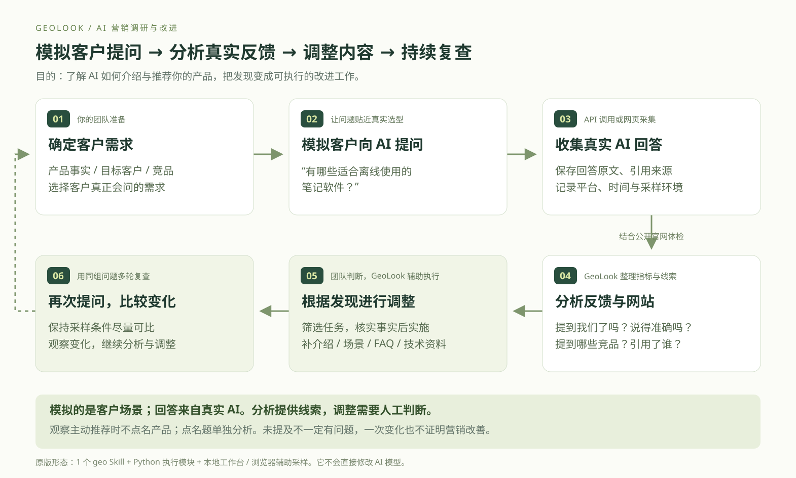
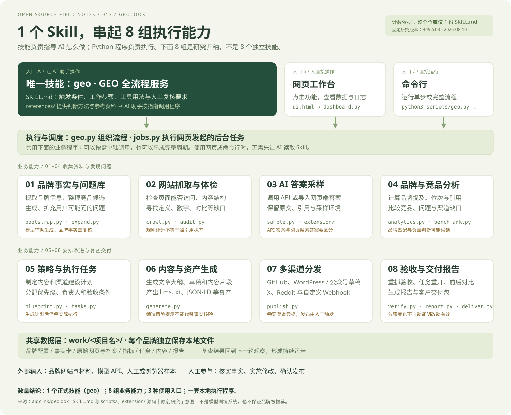

# 013 · GeoLook 原版实测与完整案例

GeoLook 帮营销团队模拟客户向 AI 提问，观察自己的产品是否被提及、如何被介绍，再根据发现安排改进和复查。

**确定客户需求 → 模拟客户向 AI 提问 → 收集真实回答 → 分析提及、竞品和引用 → 调整内容与网站 → 再次提问复查**

[](https://yydshly.github.io/0908_codex_project/demos/013-geolook/)

**模拟的是客户场景，AI 回答是真实采集的；分析提供线索，调整需要人工判断。**

具体分析产品提及、竞品、描述准确性和引用来源，结合官网检查形成待验证的问题。团队筛选任务、核实事实并调整公开内容，再用同组问题多轮复查。未提及可能来自需求不匹配、信息缺口或回答波动，不能直接归因于网站问题。

## 演示与研究来源

用真实 Obsidian 官网与实际 AI 网页回答，展示「提出营销问题 → 采样 → 体检 → 任务 → 资产 → 技术验收 → 交付」。原版程序已实际运行；中文导览将证据串成七步。

- **[公开整体引导页](https://yydshly.github.io/0908_codex_project/demos/013-geolook/)**
- [完整真实案例](https://yydshly.github.io/0908_codex_project/demos/013-geolook/real.html)
- [原版工作台（仅本机启动后可用）](http://127.0.0.1:8765/)：在设置中进入 **Obsidian**；**Obsidian 研究副本**是本地技术实验。
- [旧版教学沙盘与架构](https://yydshly.github.io/0908_codex_project/demos/013-geolook/teaching.html#inside)
- 上游：[aigclink/geolook](https://github.com/aigclink/geolook)，MIT；固定版本 [9492cb3](https://github.com/aigclink/geolook/tree/9492cb3a1952f1370cca0f66715f87165fd56e2c)，提交日期 2026-08-10。
- 实测日期：2026-09-09，Asia/Shanghai。本案例不是 Obsidian 委托或认可的营销项目。

公开网站展示引导与保存的实测证据，GitHub Pages 不执行 Python、采样或后台发布。需要新一轮数据时自行运行原版。

## 实际完成

| 环节 | 实测结果 | 能说明什么 |
| --- | --- | --- |
| 官网抓取与体检 | 12 页返回 200；原版均分 41.4 | 能保存快照、执行规则检查；分数不是品牌或产品质量 |
| AI 网页采样 | 4 个新会话的真实回答 | 3 条未点名题中 2 条提及品牌；1 条点名题单列 |
| 执行清单 | 18 条任务，14 条可自动验收 | 能转成负责人、动作、验收条件 |
| 资产生成 | 12 项索引条目，含 4 份文章大纲 | 内容与技术素材骨架，并非 12 篇成稿 |
| 本地技术修复 | 3 项条件完成、撤销后重开、恢复后再完成 | 原版根据实际 HTTP 抓取结果改变任务状态 |
| 报告交付 | 阶段报告、三份交付报告与原始文件 | 能输出可查阅的阶段成果 |

真实回答经浏览器采集后，交给原版解析和入库。品牌事实与问题由研究助手整理；没有配置 API 密钥，没有验证自动品牌抽取或 AI 长文草稿。单轮小样本标为 D 待复核，不能解读为总体推荐概率。

本地修复实验仅修改独立研究页面，未修改 Obsidian 官网。没有执行公开发布、上线后的营销复采或订单归因。技术验收通过不证明营销效果提高。

## 实際发现的局限

- JSON-LD 把操作系统默认写成 `Web`，价格仍有 `<填>`；英文定义沿用输入中的中文。模板需要人工核实和编辑。
- 自动抓取包含多语言页面，统一长度规则不一定适合每种页面。
- 原版导入会追加样本行，采样指标去重，但另一路分析读取原始行，本次曾出现界面与指标文件不一致。研究导入脚本现避免同一会话重复导入，保留清理前记录，未修改上游源码。

## 技能数量与整体图

只有 **1 个正式 Skill：`geo`**，定义在上游根目录 `SKILL.md`。8 组是本研究归纳的执行能力，Python 模块与扩展不另算技能。



更多说明见 [源码导读](notes/implementation.md)、[实测记录](notes/real-case.md) 与 [验收记录](notes/verification.md)。

## 启动与验证

根目录运行 `python -m http.server 8013 --directory web/013-geolook --bind 127.0.0.1`，打开 `/real.html`。静态导览不依赖原版后台。构建用 `python scripts/build.py`，产物在 `_site/demos/013-geolook/real.html`。公开站点通过仓库现有 GitHub Pages 工作流部署。

原版源码在 Git 忽略的 `upstream/geolook`；因使用 `fcntl`，本次通过 WSL Ubuntu 22.04 / Python 3.10 运行。依赖独立放在 `upstream/geolook-runtime/deps`，未修改系统 Python。已有环境运行：

```powershell
./projects/013-geolook/experiments/start-original.ps1
```

这会前台启动工作台；退出终端后需重新启动。复现实验见实测记录。

```powershell
python projects/013-geolook/experiments/check-real.py
node --check web/013-geolook/real.js
node projects/013-geolook/experiments/check-demo.cjs
python scripts/build.py --check
```

真实官网与 AI 回答会随时间变化；保留的实测文件不会自动更新。
